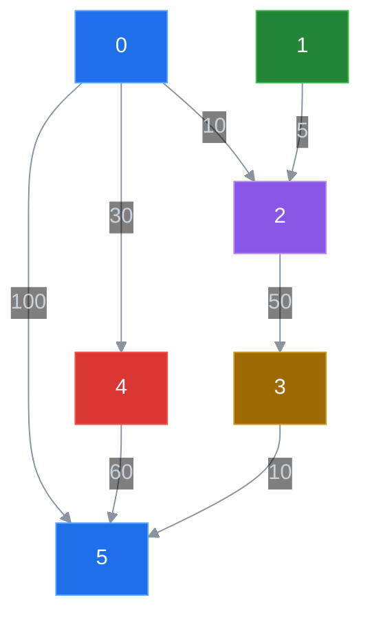

# 数据结构

数据结构通常讨论：
- 逻辑结构
- 存储结构
- 数据运算

常用的四种数据类型为：
- 顺序存储结构
- 链式存储结构
- 索引存储结构
- 散列存储结构

# 算法

对特定问题求解步骤的一种描述，它是指令的有限序列，其中每一条指令表示计算机的一个或多个操作

算法具有以下五个特性：
- 有穷性
- 确定性
- 可行性
- 输入性
- 输出性

## 算法的时间复杂度分析

事后分析估算方法：执行算法若干次，通过计时器计时；<br>
$\qquad$缺点：必须依据算法实现编制好的测试程序，且不同测试环境的差别导致测试结果的差异大

```java
    public static void main(String[] args) {
        long start = System.currentTimeMillis();

        int sum = 0;
        int n = 100;
        for (int i = 1; i <= n; i++) {
            sum += i;
        }
        System.out.println("sum = " + sum);

        long end = System.currentTimeMillis();
        System.out.println(end - start);
    }
```

事前分析估算方法：在计算机程序编写前，依据统计方法对算法进行估算，经过总结，发现一个高级语言编译的程序在计算机上运行所消耗的时间取决与下列因素：<br>
$\qquad$ 1.算法所采取的策略和方案；<br>
$\qquad$ 2.编译所产生的代码量；<br>
$\qquad$ 3.问题的输入规模(输入量)；<br>
$\qquad$ 4.机器执行指令的速度；<br>
若不计与计算机硬件、软件有关的因素，一个程序的运行时间依赖于算法的优劣和问题的输入规模。

- 算法的执行时间去解决于**控制结构**和**原操作**的综合效果
- 子啊一个算法中，执行**原操作的次数越少**，其**执行时间**也就相对**越少**，执行**原操作次数越多**，其**执行时间**也就行对**越多**
- 算法中所有原操作的执行次数称为**算法频度**，这样一个算法的执行时间可以由算法频度来计量

**需求**：<br>
$\qquad$ 计算 1 到 100 的和<br>

```java
    public static void main(String[] args) {
        int sum = 0;
        int n = 100;
        for (int i = 1; i <= n; i++) {
            sum += i;
        }
        System.out.println("sum = " + sum);
    }
    //当输入量 n 为 x 时，需要计算 x 次
```

---

```java
    public static void main(String[] args) {
        int sum = 0;
        int n = 100;
        sum = n * (n + 1) / 2;
        System.out.println("sum = " + sum);
    }
    //当输入量为 n 为 x 时，需要计算 1 次
```

上述两种求和方法的时间复杂度分别为 $n$ 和 $1$

### 函数渐进增长

将算法执行次数与输入规模构建函数 $F(n)$<br>
通过比较 $E_1(n), E_2(n^2), E_3(n^3), E_5(2n), E_6(2n^2+2n+1), E_7(n+1), E_8(1)$<br>
可以得到结论：<br>
$\qquad$**1.算法函数中的常数可以忽略**<br>
$\qquad$**2.算法函数中最高次幂的常数因子可以忽略**<br>
$\qquad$**3.算法函数中 n 最高次幂越小，算法效率越高**<br>

### 算法时间复杂度

给出三个算法的执行次数(算法频度):<br>
$\qquad$算法$1$：$T(n) = 3$ 次<br>
$\qquad$算法$2$：$T(n) = n + 3$ 次<br>
$\qquad$算法$3$：$T(n) = n^2 + 2$ 次<br>

规则：<br>
$\qquad$**1.用常数1取代运行时间中的所有加法常数**<br>
$\qquad$**2.在修改后的运行次数中，只保留高阶项**<br>
$\qquad$**3.如果最高阶项存在，且常数因子不为1，则去除与这个项相乘的常数**<br>

上述三种算法可以记为：<br>
$\qquad$算法$1$：$O(1)$<br>
$\qquad$算法$2$：$O(1)$<br>
$\qquad$算法$3$：$O(n^2)$<br>

" $O$ " 的形式定义为：
$T(n) = O(T(n))$ 表示存在一个正常数 $c$，使得当 $n \geq n_0$ 时都满足：

$$|T(n)| \leq c|f(n)|$$

$f(n)$ 是 $T(n)$ 的上界(通常为上确界)，也就是只求出 $T(n)$ 的最高阶，忽略其低阶项和常系数

#### 1.线性阶

一般含有非嵌套循环涉及线性阶，随着输入规模的增大。对应计算次数呈直线增长,时间复杂度为 $O(N)$

#### 2.平方阶

一般嵌套循环属于时间复杂度 $O(N^2)$ 的

#### 3.立方阶

一般三层嵌套循环属于时间复杂度 $O(N^3)$ 的

#### 4.对数阶

如

```java
    int i = 1, n = 100;
    while(i < n){
        i = i * 2;
    }
```

每次循环都会执行 $i * 2$ ，若 $x$ 次后退出循环，则有 $2 ^ x = N$ ,即 $x = log_{2}N$ ,时间复杂度为 $O(logN)$ <br>
随着输入规模 n 的增加，无论底数值，增长趋势都相同，故可以忽略底数

(底数可以提取为常系数： $log_{2}N = log_{10}N/log_{10}2$)

#### 5.常数阶

一般不涉及循环操作的都是常数阶，不随 n 增长而增加操作次数，时间复杂度为 O(1)

---
|描述|增长的数量级|说明|举例|
|--|--|--|--|
|常数级别|$1$|普通语句|四则运算|
|对数级别|$logN$|二分策略|二分查找|
|线性级别|$N$|循环|查找最大元素|
|线性对数级别|$NlogN$|分治思想|归并排序|
|平方级别|$N^2$|双层循环|检查所有元素对|
|立方级别|$N^3$|三层循环|检查所有三元组|
|指数级别|$2^N$|穷举查找|检查所有子集|
---

### 最坏情况

如在数组

```java
        int[] arr = {11, 10, 8, 9, 7, 22, 23, 0}
```

中查找某个数字<br>

**最好情况：**<br>
$\qquad$第一个数字就是期望的数字，那么算法的时间复杂度为 $O(1)$

**最坏情况：**<br>
$\qquad$最后一个数字才是期望的数字，那么算法的时间复杂度为 $O(N)$

**平均情况：**<br>
$\qquad$任何数字查找的平均成本为 $O(N/2)$

设一个算法的输入规模为 $n$ ，$D_n$ 是所有输入的集合，任意输入 $I \in D_n$，$P(I)$ 是 $I$ 出现的概率，有 ，$T(I)$ 是算法在输入 $I$ 下的执行时间，则算法的**平均时间复杂度**为：

$$A(n) = \sum_{I \in D_n} P(I) * T(I)$$

## 算法的空间复杂度分析

### Java中常见内存占用
1. 基本数据类型内存占用情况：

|数据类型|内存占用字节数|
|--|--|
| `byte` | $1$ |
| `short` | $2$ |
| `int` | $4$ |
| `long` | $8$ |
| `float` | $4$ |
| `double` | $8$ |
| `boolean` | $1$ |
| `char` | $2$ |

2. 计算机访问内存的方式为一字节

3. 一个引用(机器地址)需要 8 个字节表示：<br>
$\qquad$例如：Date date = new Date(); 中， date 这个变量需要 8 个字节来表示

4. 创建一个对象，，如 new Date();中，除了 Date 对象内部存储的数据占用的内存，该对象本身也有内存开销，每个对象的自身开销为 16 个字节，用来保存对象的头信息

5. 一般内存的使用，如果不够 8 个字节，会被自动填充为 8 个字节：

```java
    public class A {
        public int a = 1;
    }

    /*
        通过 new A(); 创建一个对象的内存占用如下：
            1.整型成员变量 a 占用 4 个字节；
            2.对象本身占用 16 个字节；
        那么创建该对象总共需要 20 个字节，但由于不是 8 位单位，会自动填充至 24 字节
    */
```

6. Java中数组被限定为对象，一般会因记录长度而需要额外的内存，一个原始数据类型的数组一般都需要 24 字节的头信息(16 个自己的对象开销， 4 字节用于保存长度以及 4 个填充字节)再加上保存值所需要的内存

### 算法的空间复杂度

算法的空间复杂度的计算公式记作：$ S(n) = O(f(n)) $

**需求**：<br>
$\qquad$ 对指定的数组元素进行反转，并返回反转的内容<br>

```java
    public static int[] reverse_1(int[] arr) {
        int n = arr.length();       //申请 4 字节
        int temp;                   //申请 4 字节
        for (int start = 0, end = n - 1;start <= end;start++, end--) {
            temp = arr[start];
            arr[start] = arr[end];
            arr[end] = temp;
        }
        return arr;
    }
```

---

```java
    public static int[] reverse_2(int[] arr) {
        int n = arr.length();       //申请 4 字节
        int[] temp = new int[n];    //申请 4n 字节 + 数组自身头信息开销 24 字节
        for (int i = n - 1; i >= 0; i--) {
            temp[n - 1 - i] = arr[i];
        }
        return temp;
    }
```

不记判断条件占用的内存，得出内存占用情况如下：

算法1：<br>
$\qquad$无论传入数组大小，始终额外申请 $4 + 4 = 8$ 个字节<br>
$\qquad$空间复杂度为 $O(1)$<br>
算法2：<br>
$\qquad$共计申请 $4 + 4n + 24 = 4n + 24$ 字节<br>
$\qquad$空间复杂度为 $O(n)$<br>

## 时空权衡

时空权衡指通过降低或提高算法的空间小路来提高或降低时间效率

常用的以空间换时间的方法有：
- 散列法
- 缓存
- 链式存储结构

## 递归

**问题分解**：把一个不能或不便解决的复杂问题转化为一个或多个与原问题相似的规模较小的问题来求解<br>
递归策略只需少量的代码就可以描述出解题过程所需要的多次重复计算<br>
**递归边界条件**：确定递归何时终止（递归出口）<br>
**递归模式**：问题分解的过程（递归体）<br>

### 应用

以下三种情况通常使用递归方法：<br>
- 定义是递归的（如 $Fibonacci$ 数列）
- 数据结构是递归的（如链表）
- 问题的求解方法是递归的（如汉诺塔问题）

#### 汉诺塔问题

```java
    public class Hanoi {
        public static void main(String[] args) {
            hanoi(4, 'A', 'B', 'C');
        }

        public static void hanoi(int n, char X, char Y, char Z) {
            if (n == 1) {
                System.out.printf("将第%d个盘片从%c移动到%c\n", n, X, Z);
            } else {
                hanoi(n - 1, X, Z, Y);
                System.out.printf("将第%d个盘片从%c移动到%c\n", n, X, Z);
                hanoi(n - 1, Y, X, Z);
            }
        }
    }
```

**递归算法的时空分析**<br>
$\quad$ 以汉诺塔问题为例：<br>
$\qquad$ **时间复杂度**
$\qquad$ $$ T(n) = \begin{cases} 1, \quad n = 1\\ 2 T(n - 1) + 1, \quad n > 1 \end{cases} $$

$\qquad$ **空间复杂度**<br>
$\qquad$ $$ S(n) = \begin{cases} 1, \quad n = 1 \\ S(n - 1) + 1, \quad n > 1 \end{cases} $$

### 递归执行过程

**递归内部执行过程**<br>
- 一个递归函数的调用过程类似于多个含函数的嵌套调用，但调用函数和被调用的函数是同一个函数
- 为了保证递归函数的正确执行，系统需设立一个工作栈（用于存放函数的**局部变量**、函数的**返回地址**和**值、参**）

$\qquad$ 从 `main` 函数开始，每执行一个函数便将其入栈，执行结束后出栈，返回到外层函数

### 递归算法设计

需求：设计 `pow(x, n)` 用于计算 $x^n$ （ $n$ 为大于 $1$ 的整数）
$\qquad$ $$ f(x, n) = \begin{cases} 1, \quad n = 0 \\ x \cdot f(x, \frac {n}{2}) \cdot f(x, \frac {n}{2}), \quad \small {n 为奇数} \\ f(x, \frac {n}{2}) \cdot f(x, \frac {n}{2}), \quad \small {n 为偶数}\end{cases} $$

```java
    public static double pow(double x, int n) {
        if (n == 0) {
            return 1;
        }
        double p = pow(x, n / 2);
        if (n % 2 == 1) {
            return x * p * p;
        } else {
            return p * p;
        }
    }
```

---

将 $x^{11}$ 简化为 $x^{[1011]_B}$，即 $x^{[1011]_B} = 1 \cdot x^1 + 1 \cdot x^2 + 0 \cdot x^4 + 1 \cdot x^8$ （系数为原二进制指数的第 n 位，与位权对应）

```java
    //快速幂算法
    public static double pow(double x, int n) {
        double result = 1.0, base = x;
        while (n != 0) {
            if ((n & 1) == 1) {
                //对 n 按位与，得到其二进制的最后一位
                result *= base;
            }
            base *= base;
            //将 n 右移一位
            n >>= 1;
        }
        return result;
    }
```

## 排序算法

### 比较

通常使用 `Comparable` 接口中提供的 `compareTo` 方法实现两个对象的比较<br>
`Comparable` 接口的实现类(或子接口)可以作为 `Comparable` 接口的类型参数

```java
    public class Element implements Comparable<Element> {
        //重写以下方法以实现 Element 类对象的比较
        @Override
        public int compareTo(Element e){
            return 0;
        }
    }
```

同时，泛型类的类型参数 `T` 如果继承了 `Comparable` 类，意味着 T 类型
的对象可以通过从 `compareTo` 方法与其他对象进行比较

```java
    public class Test<T extends Comparable<T>> {}
    //类型参数必须是 Comparable 接口的实现类
```

也可以写为

```java
    public class Test<T extends Comparable<? super T>> {}
    //这种写法不再要求 T 直接实现 Comparable 接口，只要其父类实现了 Comparable 接口 T 类型的对象也可以通过其父类的 compareTo 方法进行比较
```

### 插入排序

#### 直接插入排序

在已形成的**线性表中线性查找**，并在适当的位置插入，把原来位置的元素向后**顺移**

```java
    public static void sort(Comparable[] arr) {
        Comparable temp;
        for (int i = 1; i < arr.length; i++) {
            for (int j = i; j > 0; j--) {
                //比较索引j处和索引j-1处的值，如果索引j-1处的值更大，则交换位置
                if (arr[j - 1].compareTo(arr[j]) > 0) {
                    temp = arr[j];
                    arr[j] = arr[j - 1];
                    arr[j - 1] = temp;
                } else {
                    break;
                }
            }
        }
    }
```

- **时间效率** $O(n)$

    - **最好情况**

    $$C_{min} = \sum_{i = 1}^{n - 1} 1 = n - 1 = O(n)$$

    - **最坏情况**

    $$C_{max} = \sum_{i = 1}^{n - 1} i = \frac{n(n - 1)}{2} = \frac{1}{2} (n^2 - n) = O(n^2)$$

    $$M_{max} = \sum_{i = 1}^{n - 1} (i + 2) = \frac{(n - 1)(n + 4)}{2} = O(n^2)$$

- **空间效率** $O(1)$

#### 折半插入排序

```java
    public static void sort(Comparable[] arr) {
        int low, high, mid;
        Comparable temp;
        for (int i = 1; i < arr.lenth; i++) {
            temp = arr[i];
            low = 0;
            high = i - 1;
            while (low <= high) {
                mid = (low + high) / 2;
                if (temp.compareTo(arr[mid]) < 0) {
                    high = mid - 1;
                } else {
                    low = mid +1;
                }
            }
            for (int j = i - 1; j >= high + 1; j--) {
                arr[j + 1] = arr[j];   
            }
            arr[high + 1] = temp;
        }
    }
```

#### 希尔排序（缩小增量排序）

先取定一个正整数 $d_1 < n$ ，把全部记录分成 $d_1$ 个组，所有距离为 $d_1$ 倍数的记录放在一组中，在各组内进行插入排序；然后取 $d_2 < d_1$ ，重复上述分组和排序工作，直至 $d = 1$

```java
    public static void sort(Comparable[] arr) {
        //1.根据数组的长度确定增长量h的初始值
        int h = arr.length / 2;
        //2.希尔排序
        Comparable temp;
        while (h >= 1) {
            //排序
            //2.1.找到待插入的元素
            for (int i = h; i < arr.length; i++) {
                //2.2.把待插入的元素插入到有序数列中
                for (int j = i; j >= h; j -= h) {
                    //待插入的元素为arr[j]，比较arr[j]和arr[j-h]
                    if (arr[j - h].compareTo(arr[j]) > 0) {
                        temp = arr[j - h];
                        arr[j - h] = arr[j];
                        arr[j] = temp;
                    } else {
                        break;
                    }
                }
            }
            //减小h的值
            h /= 2;
        }
    }
```

- 通常认为希尔排序的**时间复杂度**为 $O(n^{1.58})$
- **空间效率** $O(1)$

### 交换排序

#### 冒泡排序

```java
    public static void sort(Comparable[] arr) {
        Comparable temp;
        for (int i = 0; i < arr.length; i++) {
            for (int j = 0; j < arr.length - i - 1; j++) {
                //将索引为j和索引为j+1的值比较，并将较大的放在后面
                if (arr[j].compareTo(arr[j + 1]) > 0) {
                    temp = arr[j];
                    arr[j] = arr[j + 1];
                    arr[j + 1] = temp;
                } else {
                    break;
                }
            }
        }
    }
```

- **时间效率**

    - **最好情况**
    
        $$C_{min} = n - 1 = O(n)$$

        $$M_{min} = 0$$

    - **最坏情况**

        $$C_{max} = \sum_{i = 0}^{n - 2} (n - i - 1) = \frac{n(n - 1)}{2} = O(n^2)$$

        $$M_{max} = \sum_{i = 0}^{n - 2} 3(n - i - 1) = \frac{3n(n - 1)}{2} = O(n^2)$$

#### 快速排序

```java
    public static void sort(Comparable[] arr, int min, int max) {
        //安全性校验
        if (min >= max) {
            return;
        }

        //随机选取基准，极大程度降低由于输入近似最坏情况出现递归过深导致栈溢出
        //以下这段代码仅用于维护数据量较大的测试类中正常运行，实际破坏了测试类提供的最坏情况
        int randomIndex = min + (int)(Math.random() * (max - min + 1));
        Comparable temp = arr[randomIndex];
        arr[randomIndex] = arr[min];
        arr[min] = temp;

        //分组
        int pivot = partition(arr, min, max);
        //使左子组有序
        sort(arr, min, pivot - 1);
        //使右子组有序
        sort(arr, pivot + 1, max);
    }

    public static int partition(Comparable[] arr, int min, int max) {
        //确定分界值
        Comparable pivot = arr[min];
        //定义两个指针，分别指向最小索引和最大索引的下一位
        int left = min, right = max + 1;
        //切分
        while (true) {
            //从右到左扫描，遇到的元素大于分界值时停止
            while (arr[--right].compareTo(pivot) > 0) {
                if (right == min) break;
            }
            //从左到右扫描，遇到的元素大于小于分界值时停止
            while (arr[++left].compareTo(pivot) < 0) {
                if (left == max) break;
            }
            //判断left >= right，若为真则扫描完毕，结束循环，否则交换元素
            if (left >= right) {
                break;
            } else {
                Comparable temp = arr[left];
                arr[left] = arr[right];
                arr[right] = temp;
            }
        }
        //交换分界值
        Comparable temp = arr[min];
        arr[min] = arr[right];
        arr[right] = temp;
        return right;
    }
```

- **时间效率**

    - **最好情况**<br>
    如果初始数据序列随机分布不，使每次划分恰好为两个长度相等的子表，此时递归树高度最小，性能最好<br>
    此时**时间复杂度**为 $O(n \log n)$

    - **最坏情况**<br>
    如果初始数据序列正序或反序，时每次划分的两个子表中一个为空一个长度为 $n - 1$ ，此时递归树高度最高，退化为冒泡排序，性能最差<br>
    此时**时间复杂度**为 $O(n^2)$

- **空间效率**
    - 快速排序是递归的，需要有一个栈存放每层递归调用是的指针和参数，**平均空间复杂度** $O(\log n)$

### 选择排序

#### 简单选择排序

每一次遍历在后面 $n - 1$ 个待排记录中选取关键字最小的记录作为有序序列中的第 $i$ 个记录

```java
    public static void sort(Comparable[] arr) {
        int index;
        Comparable temp;
        for (int i = 0; i < arr.length; i++) {
            index = i;
            for (int j = i; j < arr.length - 1; j++) {
                //获取最小值所对应的索引，并于尚未排序元素的第一位交换位置，在此循环前，index为已排序元素最后一位的索引
                if (arr[index].compareTo(arr[j + 1]) > 0) {
                    index = j + 1;
                }
            }
            temp = arr[index];
            arr[index] = arr[i];
            arr[i] = temp;
        }
    }
```

- **时间效率**
    $$C(n) = \sum_{i = 0}^{n - 2} (n - i - 1) = \frac{n(n  - 1)}{2} = O(n^2)$$

#### 堆排序

时间复杂度为 $O(n \log n)$ ，不受数据输入分布影响，空间复杂度为 $O(1)$，是一种不稳定的排序算法

- **实现步骤：**<br>
    1. 构造堆<br>
        - 把待排序的**所有键值表示成一棵完全二叉树**
        - 从**最后一个非叶子结点**开始，即 $i = \large \frac{n}{2}$ ，以其为**根**，将该**子树调整为堆**；**在调整下一个非叶子结点**，逐个调整**至**以**第一个非叶子结点**为根的树**调整为堆**
    2. 得到堆顶元素(即最大值)<br>
    3. 交换堆顶元素和数组中最后一个元素，此时数组中所有元素的最大值已经处于正确位置<br>
    4. 对堆进行调整，令除排序完成元素外所有元素中最大值上浮至堆顶<br>
    5. 重复以上步骤直至堆内仅剩最后一个元素为止<br>

```java
    public static void sort(Comparable[] source) {
        //构建堆
        Comparable[] heap = new Comparable[source.length + 1];
        createHeap(source, heap);
        //记录未排序元素的最大索引
        int N = source.length;
        //通过循环交换 1 索引处的元素和未排序的元素中最大索引处的元素
        while (N > 1) {
            //交换最大元素所在的索引，不再参与下沉过程
            swap(heap, 1, N);
            N--;
            sink(heap, 1, N);
        }
        System.arraycopy(heap, 1, source, 0, source.length);
    }

    public static void createHeap(Comparable[] source, Comparable[] heap) {
        //将 source 中的元素拷贝到 heap 中形成一个无序的堆
        System.arraycopy(source, 0, heap, 1, source.length);
        //对堆中元素进行下沉（从长度的一半处，即最后一个非终端结点开始向 1 处扫描）
        for (int i = (heap.length) / 2; i > 0; i--) {
            sink(heap, i, heap.length - 1);
        }
    }

    public static void swap(Comparable[] heap, int i, int j) {
        Comparable temp = heap[i];
        heap[i] = heap[j];
        heap[j] = temp;
    }

    private static void sink(Comparable[] heap, int target, int range) {
        while (2 * target <= range) {
            //找出当前结点下较大的子结点
            int max;
            if (2 * target + 1 <= range) {
                max = (heap[2 * target].compareTo(heap[2 * target + 1]) >= 0) ? 2 * target : 2 * target + 1;
            } else {
                max = 2 * target;
            }
            //比较当前结点和较大子结点的值
            if (max < target) {
                break;
            }
            swap(heap, target, max);
            target = max;
        }
    }
```

- **时间复杂度** $O(n \log n)$

- **空间复杂度** $O(1)$

### 归并排序

```java
    public static void sort(Comparable[] arr) {
        //1.初始化辅助数组assist
        Comparable[] assist = new Comparable[arr.length];
        //2.定义一个min变量和max变量，分别记录数组中最小索引和最大索引
        int min = 0, max = arr.length - 1;
        //3.调用sort重载方法完成数组arr中，从索引min到索引max元素的排序
        sort(arr, min, max, assist);
    }

    public static void sort(Comparable[] arr, int min, int max, Comparable[] assist) {
        //安全性校验
        if (min >= max) {
            return;
        }
        //对索引min到索引max中的数据分为两组进行排序
        int mid = min + (max - min) / 2;
        //与(min + max)/2相同，但是能避免相加时造成数据溢出
        //分别对每一组数据进行排序
        sort(arr, min, mid, assist);
        sort(arr, mid + 1, max, assist);
        //将两个组中的数据进行归并
        merge(arr, min, mid, max, assist);
    }

    public static void merge(Comparable[] arr, int min, int mid, int max, Comparable[] assist) {
        int i = min, p1 = min, p2 = mid + 1;
        while (p1 <= mid && p2 <= max) {
            if (arr[p1].compareTo(arr[p2]) <= 0) {
                assist[i++] = arr[p1++];
            } else {
                assist[i++] = arr[p2++];
            }
        }
        while (p1 <= mid) {
            assist[i++] = arr[p1++];
        }
        while (p2 <= max) {
            assist[i++] = arr[p2++];
        }
        for (int k = min; k <= max; k++) {
            arr[k] = assist[k];
        }
    }
```

- **时间效率**<br>
二路归并排序中，长度为 $n$ 的排序表需做 $\lceil \log_2 n \rceil$ 次归并，对应的归并树高度为 $\lceil \log_2 n \rceil$ <br>
时间复杂度最好、最坏、平均情况**时间复杂度**都为 $O(n \log n)$

- **空间效率**<br>
空间复杂度 $O(n)$

### 基数排序
- 基数排序是一种借助于**多关键字排序**的思想对**单关键字排序**的方法
- 一般的，在基数排序中元素 `E` 的关键字 `E.key` 是由 $d$ 位数字组成，即 $k^{d - 1} 、 k^{d - 2} 、 \dots 、 k^0$ ，每一位数字表示关键字的一位，其中 $k^{d - 1}$ 为最高位， $k^0$ 为最低位，
每一位的值都在 $0 \leq k^i \lt r$ 范围内， $r$ 称为**基数**
    - 假设**最高位是最重要位，最低位是最不重要位，应从最低位开始排序**，称为最低位优先 $(LSD)$
    - 反之**最低位是最重要位，最高位是最不重要位，应从最高位开始排序**，称为最高位优先 $(MSD)$

假设线性表由元素序列 $a_1 、 a_2 \dots a_n$ 构成，每个结点 $a_j$ 的关键字由 $d$ 元组 $(k^{d - 1}, k^{d - 2}, \dots , k^0)$ 其中每个元素值在 $0 \sim r - 1$ 之间，在排序过程中使用 $r$ 个队列 $Q_0 、 Q_1 \dots Q_{r - 1}$
- 对 $i = 0 、 1 、 \dots 、 d - 1$ （从低位到高位），依次做一次**分配**和**收集**
    - **分配**<br>
    开始时，将 $Q_0 、 Q_1 \dots Q_{r - 1}$ 各个队列置空，然后依次考察线性表中的每一个元素 $a_j(j = 1 、 2 、 \dots 、 n)$ ，如果 $a_j$ 的关键字 $k^i_j = k$ ，就把 $a_j$ 插入队列 $Q_k$ 中
    - **收集**<br>
    将 $Q_0 、 Q_1 \dots Q_{r - 1}$ 各个元素依次首尾相接，得到新的元素序列，组成新的线性表

```java

```

- **时间复杂度** $O(d(n + r))$
- **空间复杂度** $O(r)$

### 排序的稳定性

- **稳定性的定义：**<br>
数组 $arr$ 中有若干元素，其中元素 $A$ 与元素 $B$ 相等，且元素 $A$ 在元素 $B$ 前，如果使用某种排序算法排序后，能保证 $A$ 元素仍在 $B$ 元素前面，则可以说这个算法是稳定的<br>
- **稳定性的意义：**<br>
如果一组数据只需要一次排序，则稳定性一般是没有意义的，如果一组数据需要多次排序，则稳定性是有意义的<br>
- **常见排序算法的稳定性：**<br>
    - **直接插入排序**：<br>
    $\qquad$ 比较是从有序序列的末尾开始，即要插入的元素和已经有序的最大者开始比较，如果更大则插入在其后方，否则一直向前遍历直到找到应插入的位置为止，如果遇到一个与插入元素相等的，则插入在其后方，相同元素的前后顺序没有改变，原无序序列的相对顺序就是排好序后的顺序，所以直接插入排序是一种**稳定**的排序算法
    - **折半插入排序**：<br>
    $\qquad$ 仅使用二分法确定插入的目标位置，优化了比较的过程，并未改变插入的过程，所以折半插入排序是一种**稳定**的排序算法
    - **希尔排序**：<br>
    $\qquad$ 希尔排序是按照不同步长对元素进行插入排序，虽然一次插入排序是稳定的，不会改变相同元素的相对顺序，但在不同的插入排过程中，相同的元素可能在各自的插入排序中移动，最后其稳定性就会被打乱，所以希尔排序是一种**不稳定**的排序算法
    - **冒泡排序**：<br>
    $\qquad$ 只有当 $arr[i] > arr[i + 1]$ 的时候，才会交换元素的位置，而相等的时候不交换位置，所以冒泡排序是一种**稳定**的排序算法
    - **快速排序**：<br>
    $\qquad$ 快速排序需要一个基准值，在基准值的右侧找一个比基准值小的元素，在基准值的左侧找一个比基准值大的元素，然后交换这两个元素，此时会破坏稳定性，所以快速排序是一种**不稳定**的排序算法
    - **简单选择排序**：<br>
    $\qquad$ 简单选择排序是给每个位置选择当前元素最小的，如数据 ${5_1, 8, 5_2, 2}$ 在排序时 $5_1$ 与 $2$ 交换了位置，此时 $5_1$ 在 $5_2$ 之后，破坏了稳定性，所以简单选择排序是一种**不稳定**的排序算法
    - **堆排序**<br>
    在调整堆时，堆顶元素会与堆尾元素交换，此时原本树中的顺序被打乱，所以堆排序是一种**不稳定**的排序算法<br>
    - **归并排序**：<br>
    $\qquad$ 归并排序在归并的过程中，只有 $arr[i] < arr [i + 1]$ 的时候才会交换位置，如果两个元素相等则不会交换位置，所以它并不会破坏稳定性，归并排序是一种**稳定**的排序算法

# 线性表

线性表是最基本、最简单也是最常用的一种数据结构。一个线性表是 n 个具有相同特征的数据元素的有限序列
- **前驱元素：** 若元素 A 在元素 B 的前面，则称 A 为 B 的前驱元素
- **后继元素：** 若元素 B 在元素 A 的后面，则称 B 为 A 的后继元素

**线性表的特征：** 数据元素之间具有一一对应的逻辑关系
- 第一个元素没有前驱元素，称为头结点
- 最后一个元素没有后继元素，称为尾结点
- 除了头结点和尾结点外，所有元素有且仅有一个前驱元素和后继元素

**线性表的分类：** 线性表中数据存储的方式可以是顺序存储也可以是链式存储，按照数据的存储方式不同，可以把线性表分为顺序表和链式表

## 顺序表 & 链式表

`interface`

```java
    interface LinearListInterface<Type> {
        //提供基本功能模板
        //空置线性表
        void clear();
        //判断当前线性表是否为空表
        boolean isEmpty();
        //获取线性表的长度
        int length();
        //获取指定位置的元素
        Type get(int index);
        //向线性表指定位置插入元素
        void insert(int index, Type element);
        //为线性表添加新的尾结点
        void append(Type element);
        //从线性表中移除元素并返回这个元素
        Type remove(int index);
        //获取指定元素第一次出现的索引
        int indexOf(Type element);
    }
```

---

`implements`

```java
    //顺序表的实现
    import LinearList.LinearListInterface;
    import java.util.Iterator;

    public class SequenceList<T> implements LinearListInterface<T>, Iterable<T> {
        private T[] elements;   //存储元素的数组
        private int size;       //当前线性表的长度

        //创建容量为 capacity 的 SequenceList 对象
        public SequenceList(int capacity) {
            //初始化数组
            elements = (T[]) new Object[capacity];
            //初始化长度(元素个数，与实际容量无关)
            size = 0;
        }

        public SequenceList() {
            //通过 this 关键字调用构造方法
            //初始容量通常取 10
            this(10);
        }

        @Override
        public void clear() {
            elements = (T[]) new Object[10];
            this.size = 0;
        }

        @Override
        public boolean isEmpty() {
            return size == 0;
        }

        @Override
        public int length() {
            return size;
        }

        @Override
        public T get(int index) {
            if (index < 0 || index >= size) {
                throw new IndexOutOfBoundsException();
            } else {
                return elements[index];
            }
        }

        @Override
        public void insert(int index, T element) {
            //扩容
            if (size == elements.length) {
                resize(elements.length * 2);
            }
            //先把 index 索引处及其后面所有元素的索引向后移动一位
            for (int i = size - 1; i > index; i--) {
                elements[i] = elements[i - 1];
            }
            //线性表长度加一
            size++;
            //把 element 插入索引 index 处
            elements[index] = element;
        }

        @Override
        public void append(T element) {
            //扩容
            if (size == elements.length) {
                resize(elements.length * 2);
            }
            elements[size++] = element;
        }

        @Override
        public T remove(int index) {
            //记录索引 index 处的元素
            T current = elements[index];
            //索引 index 后面元素依次向前移动一位
            for (int i = index; i > size - 1; i++) {
                elements[i] = elements[i++];
            }
            //线性表长度减一
            size--;
            //缩容
            if (size < elements.length / 4) {
                resize(elements.length / 2);
            }
            return current;
        }

        @Override
        public int indexOf(T element) {
            for (int i = 0; i < size; i++) {
                if (element.equals(elements[i])) {
                    return i;
                }
            }
            return -1;
        }

        //重新分配空间，实现扩容、缩容操作
        public void resize(int newCapacity) {
            //定义一个临时数组指向原数组
            T[] temp = elements;
            //创建新数组
            elements = (T[]) new Object[newCapacity];
            //把原数组的数据拷贝到新数组
            for (int i = 0; i < size; i++) {
                elements[i] = temp[i];
            }
        }

        //为 SequenceList 提供外部的遍历;增强for循环所必须
        @Override
        public Iterator<T> iterator() {
            return new SequenceIterator();
        }

        private class SequenceIterator implements Iterator {
            private int cursor;
            public SequenceIterator() {
                this.cursor = 0;
            }

            @Override
            public boolean hasNext() {
                return cursor < size;
            }

            @Override
            public Object next() {
                return elements[cursor++];
            }
        }
    }
```

### 顺序表的时间复杂度

- get(int index):不论数据元素量 size 有多大，只需要一次 elements[index] 就可以获取到对应的元素，所以时间复杂度为 O(1)
- insert(int index, T element):每一次插入都需要把其后面的所有元素移动一次，随着数据元素量 size 的增大，移动的元素也越多，时间复杂度为 O(n)
- remove(int index):每一次删除，都需要把 index 后面的元素移动一次，随着数据元素量 size 的增加，移动的元素也越多，时间复杂度为 O(n)

由于顺序表的底层由数组实现，数组的长度是固定的，所以在操作过程中涉及到了容器扩容的操作，这样会导致在使用过程中的实际就按复杂度不是线性的，在某些需要扩容的结点处，耗时会突增，元素较多时更为明显(数组拷贝的时间复杂度为 O(n))

### 顺序存储结构的特性

- 所有元素存放在一篇地址连续的存储单元中
- 逻辑上相邻的元素在物理位置上也是相邻的，所以不需要额外空间表示元素之间的逻辑关系

$$Loc = L_0 + (i - 1) * m$$

- 已知起始元素地址和偏移量便可以快速定位要查找的元素

---

### 单向链表

单向链表是链表的一种，由多个结点组成，每个结点都由一个数据域(data)和指针域(next)组成，数据域用于存储数据，指针域用于指向其后继结点；链表头结点的数据域不存储数据，指针域指向第一个真正存储数据的结点

`implements`

```java
    //单向链表的实现
    import LinearList.LinearListInterface;
    import java.util.Iterator;

    public class LinkList<T> implements LinearListInterface<T>, Iterable<T> {
        private Node head;   //记录首结点
        private int size;       //记录链表的长度

        //结点类
        private class Node {
            T data;     //存储数据
            Node next;  //下一个结点

            public Node(T data, Node next) {
                this.data = data;
                this.next = next;
            }
        }

        public LinkList() {
            //初始化头结点
            this.head = new Node(null, null);
            //初始化元素个数
            this.size = 0;
        }

        @Override
        public void clear() {
            head.next = null;
            size = 0;
        }

        @Override
        public boolean isEmpty() {
            return size == 0;
        }

        @Override
        public int length() {
            return size;
        }

        @Override
        public T get(int index) {
            if (index < 0 || index >= size) {
                throw new IndexOutOfBoundsException();
            }
            Node current = head.next;
            //通过循环，从第一个存放数据的结点开始向后查找 index 次，就能找到对应元素
            for (int i = 0; i < index; i++) {
                current = current.next;
            }
            return current.data;
        }

        @Override
        public void insert(int index, T element) {
            if (index < 0 || index > size) {
                throw new IndexOutOfBoundsException();
            }
            //找到 index 前一位置的结点
            Node previous = head;
            for (int i = 0; i < index; i++) {
                previous = previous.next;
            }
            //找到 index 位置的结点
            Node current = previous.next;
            //创建新结点并且新结点指向原来 index 位置的结点
            Node newNode = new Node(element, current);
            //原来 index 位置的结点指向新结点
            previous.next = newNode;
            //元素个数加一
            size++;
        }

        @Override
        public void append(T element) {
            //找到当前最后一个结点
            Node node = head;
            while (node.next != null) {
                node = node.next;
            }
            //创建新结点，保存元素 element
            Node newNode = new Node(element, null);
            //令当前最后一个结点指向新结点
            node.next = newNode;
            //可以直接写为 node.next = new Node(element, null)
            //元素个数加一
            size++;
        }

        @Override
        public T remove(int index) {
            if (index < 0 || index >= size) {
                throw new IndexOutOfBoundsException();
            }
            //找到 index 前一位置的结点
            Node previous = head;
            for (int i = 0; i < index; i++) {
                previous = previous.next;
            }
            //找到 index 位置的结点
            Node current = previous.next;
            //找到 index 下一位置的结点
            Node next = current.next;
            //令前一结点指向下一结点
            previous.next = next;
            //元素个数减一
            size--;
            return current.data;
        }

        @Override
        public int indexOf(T element) {
            //从头结点开始，依次查找每一个结点
            Node node = head;
            for (int i = 0; node != null; i++) {
                node = node.next;
                if (node.data.equals(element)) {
                    return i;
                }
            }
            return -1;
        }

        @Override
        public Iterator<T> iterator() {
            return new LinkIterator();
        }

        private class LinkIterator implements Iterator<T> {
            private Node node = head;
            public LinkIterator() {
                this.node = head;
            }

            @Override
            public boolean hasNext() {
                return node.next != null;
            }

            @Override
            public T next() {
                node = node.next;
                return node.data;
            }
        }
    }
```

### 双向链表

双向链表也叫双向表，是链表的一种，由多个结点组成，每个结点都由一个数据域(data)和两个指针域(previous & next)组成，其中一个指针域指向前驱结点，另一个指针域指向后继结点；链表投机点的数据域不存储数据，指向前驱结点的指针域为 null ，指向后继结点的指针域指向第一个真正存放数据的结点

`implements`

```java
    //双向链表的实现
    import LinearList.LinearListInterface;
    import java.util.Iterator;

    public class TwoWayLinkedList<T> implements LinearListInterface<T>, Iterable<T> {
        private Node head;  //记录首结点
        private Node tail;  //记录尾结点
        private int size;   //记录链表长度

        //结点类
        private class Node {
            public Node(T data, Node previous, Node next) {
                this.data = data;
                this.previous = previous;
                this.next = next;
            }

            public T data;          //存储数据
            public Node previous;   //指向上一个结点
            public Node next;       //指向下一个结点
        }

        public TwoWayLinkedList() {
            //初始化头结点和尾结点
            this.head = new Node(null, null, null);
            this.tail = null;
            //初始化元素个数
            this.size = 0;
        }

        //获取第一个元素
        public T getFirst() {
            return isEmpty() ? null : head.next.data;
        }

        //获取最后一个元素
        public T getLast() {
            return isEmpty() ? null : tail.data;
        }

        @Override
        public void clear() {
            this.head.next = null;
            this.tail = null;
            this.size = 0;
        }

        @Override
        public boolean isEmpty() {
            return size == 0;
        }

        @Override
        public int length() {
            return size;
        }

        @Override
        public T get(int index) {
            if (index < 0 || index >= size) {
                throw new IndexOutOfBoundsException();
            }
            Node current = head.next;
            for (int i = 0; i < index; i++) {
                current = current.next;
            }
            return current.data;
        }

        @Override
        public void insert(int index, T element) {
            if (index < 0 || index > size) {
                throw new IndexOutOfBoundsException();
            }
            //找到 index 前一位置的结点
            Node prev = head;
            for (int i = 0; i < index; i++) {
                prev = prev.next;
            }
            //找到 index 位置的结点
            Node current = prev.next;
            //创建新结点
            Node newNode = new Node(element, prev, current);
            //让 index 前一位置的下一个结点变为新结点
            prev.next = newNode;
            //让 index 位置的前一个结点变为新结点
            current.previous = newNode;
            //元素个数加一
            size++;
        }

        @Override
        public void append(T element) {
            if (isEmpty()) {
                //若链表为空：
                //创建新的结点
                Node newNode = new Node(element, head, null);
                //令新结点成为尾结点
                tail = newNode;
                //令头结点指向尾结点
                head.next = newNode;
            } else {
                //若链表不为空：
                //创建新的结点
                Node oldTail = tail;
                Node newNode = new Node(element, oldTail, null);
                //让当前的尾结点指向新结点
                oldTail.next = newNode;
                //让新结点成为尾结点
                tail = newNode;
            }
            //元素个数加一
            size++;
        }

        @Override
        public T remove(int index) {
            if (index < 0 || index >= size) {
                throw new IndexOutOfBoundsException();
            }
            //找到 index 位置的前一个结点
            Node prev = head;
            for (int i = 0; i < index; i++) {
                prev = prev.next;
            }
            //找到 index 位置的结点
            Node current = prev.next;
            //找到 index 位置的下一个结点
            Node nextNode = current.next;
            //令 index 位置的前一个结点的下一个结点成为 index 位置的下一个结点
            prev.next = nextNode;
            //令 index 位置的下一个结点的上一个结点变为 index 位置的前一个结点
            if (nextNode != null) {
                nextNode.previous = prev;
            } else {
                tail = (prev == head) ? null : prev;
            }
            //元素个数减一
            size--;
            return current.data;
        }

        @Override
        public int indexOf(T element) {
            Node current = head;
            for (int i = 0; current != null; i++) {
                current = current.next;
                if (current.data.equals(element)) {
                    return i;
                }
            }
            return -1;
        }

        @Override
        public Iterator<T> iterator() {
            return new TwoWayLinkedIterator();
        }

        private class TwoWayLinkedIterator implements Iterator<T> {
            private Node node;

            public TwoWayLinkedIterator() {
                this.node = head;
            }

            @Override
            public boolean hasNext() {
                return node.next != null;
            }

            @Override
            public T next() {
                node = node.next;
                return node.data;
            }
        }
    }
```

### 链表的时间复杂度

- get(int index):每一次查询都需要从链表的头部开始，一次向后查找，随着数据元素 size 的增加，查找的元素越多，时间复杂度为 O(n)
- insert(int index, T element):每一次插入数据，都需要先找到 index 位置的前一个元素，然后完成插入操作，随着数据元素 size 的增加，查找的元素越多，时间复杂度为 O(n)
- remove(int index):每一次移除数据，都需要先找到 index 位置的前一个元素，然后完成插入操作，随着数据元素 size 的增加，查找的元素越多，时间复杂度为 O(n)

**空间性能**

$$ \small {存储密度 = \frac {数据域占用的存储量}{结点占用的总存储量}} $$

相比较顺序表，链表插入和删除操作的时间复杂度虽然一样，但仍有很大优势，因为链表的物理地址是不连续的，它不需要预先指定存储空间大小，或者在存储过程中涉及到扩容等操作，同时也不涉及元素的交换<br>
相比较顺序表，链表的查询操作因为需要遍历目标前所有结点，因此性能较低

### 链式存储结构的特性

- 数据元素存放在任意的存储单元中，这组存储单元可以是连续的，也可以是不连续的
- 通过地址域来表示数据元素间的逻辑关系

### 链表反转

```java
    //单链表反转
    //反转整个链表
    public void reverse() {
        //判断当前链表是否为空，如果不为空则调用重载的 reverse 方法完成反转
        if (isEmpty()) {
            return;
        }
        reverse(head.next);
    }

    //反转指定的结点，并返回反转后的结点
    public Node reverse(Node current) {
        if (current.next == null) {
            head.next = current;
            return current;
        }
        //递归反转当前结点的下一结点：返回值为链表反转后当前结点的上一结点
        Node prev = reverse(current.next);
        //令返回的结点的下一结点变为当前结点
        prev.next = current;
        //把当前结点的下一结点变为 null
        current.next = null;
        return current;
    }
```

以链表 `1 -> 2 -> 3 -> 4 -> null` 为例：
- 递归先深入到最末端的 `4` ，此时它是第一个无需反转的结点(终止条件);
- 回到 `3` 时，调整 `4.next = 3` ， `3.next = null` ，得到 `4 -> 3 -> null` ;
- 再回到 `2` 时，调整 `3.next = 2` ， `2.next = null` ，得到 `4 -> 3 -> 2 -> null` ;
- 最后回到 `1` 时，调整 `2.next = 1` ， `1.next = null` ，得到 `4 -> 3 -> 2 -> 1 -> null` ;

**通过循环实现链表反转**

```java
    /**
    * 循环实现原理：
    * 使用三个指针：prev、current、next
    * 从链表头部开始，逐个节点反转指针方向
    * 每次迭代中：
    *     - 保存下一个节点的引用
    *     - 将当前节点的next指向前一个节点
    *     - 移动三个指针到下一个位置
    */
    public void _reverse() {
        // 若链表为空则直接返回
        if (isEmpty() || head.next == null) {
            return;
        }

        // 创建三个指针
        Node prev = null;
        Node current = head.next;
        Node next = null;

        while (current != null) {
            // 保存下一个节点
            next = current.next;
            // 反转当前节点的指针
            current.next = prev;
            // 移动指针
            prev = current;
            current = next;
        }

        // 更新头节点指向新的首节点
        head.next = prev;
    }
```

---

### 快慢指针

#### 中间值问题
`code`

```java
    public class MiddleNodeTest {
        public static void main(String[] args) {
            //快慢指针 - 中间值问题
            //创建结点
            Node<String> first = new Node<>("Aa", null);
            Node<String> second = new Node<>("Bb", null);
            Node<String> third = new Node<>("Cc", null);
            Node<String> fourth = new Node<>("Dd", null);
            Node<String> fifth = new Node<>("Ee", null);
            Node<String> sixth = new Node<>("Ff", null);
            Node<String> seventh = new Node<>("Gg", null);
            Node<String> eighth = new Node<>("Hh", null);

            //构建结点间的指向
            first.next = second;
            second.next = third;
            third.next = fourth;
            fourth.next = fifth;
            fifth.next = sixth;
            sixth.next = seventh;
            seventh.next = eighth;

            //查找中间值
            String mid = (String)new FastSlowTest().getMid(first);
            System.out.println("中间值为:" + mid);
        }

        /**
        * @param first 链表的首结点
        * @return 链表的中间结点的值
        */
        private <T> Object getMid(Node<T> first) {
            //定义两个指针
            Node<T> slow = first;
            Node<T> fast = first;

            //令快慢指针遍历链表，当快指针无下一个结点时，遍历结束，慢指针指向的结点为中间结点
            //如果为链表长度为偶数，返回第二个中间结点(向上取整)
            while (fast != null && fast.next != null) {
                fast = fast.next.next;
                slow = slow.next;
            }
            return slow != null ? slow.data : null;
        }

        private static class Node<T> {
            T data;
            Node<T> next;

            public Node(T data, Node<T> next) {
                this.data = data;
                this.next = next;
            }
        }
    }
```

`output`

```
    中间值为:Ee
```

#### 单向链表是否有环问题

`code`

```java
    public class LinkedListCycleTest {
        public static void main(String[] args) {
            //快慢指针 - 链表是否有环问题
            //创建结点
            Node<String> first = new Node<>("Aa", null);
            Node<String> second = new Node<>("Bb", null);
            Node<String> third = new Node<>("Cc", null);
            Node<String> fourth = new Node<>("Dd", null);
            Node<String> fifth = new Node<>("Ee", null);
            Node<String> sixth = new Node<>("Ff", null);
            Node<String> seventh = new Node<>("Gg", null);

            //构建结点间的指向
            first.next = second;
            second.next = third;
            third.next = fourth;
            fourth.next = fifth;
            fifth.next = sixth;
            sixth.next = seventh;

            //判断是否有环
            System.out.println("链表成环情况为:" + isCycle(first));

            //产生环
            seventh.next = third;

            //判断是否有环
            System.out.println("链表成环情况为:" + isCycle(first));
        }

        /**
        * 判断链表中是否有环结构
        * @param first 链表的首结点
        * @return 若有环结构则返回 true 反之返回 false
        */
        private static <T> boolean isCycle(Node<T> first) {
            //定义两个指针
            Node<T> slow = first;
            Node<T> fast = first;

            //遍历链表，如果快慢指针指向了同一结点，则存在环
            while (fast != null && fast.next != null) {
                fast = fast.next.next;
                slow = slow.next;
                if (fast == slow) {
                    return true;
                }
            }
            return false;
        }

        private static class Node<T> {
            T data;
            Node<T> next;

            public Node(T data, Node<T> next) {
                this.data = data;
                this.next = next;
            }
        }
    }
```

`output`

```
    链表成环情况为:false
    链表成环情况为:true
```

#### 有环链表入口问题

`code`

```java
    public class CycleEntryNodeTest {
        public static void main(String[] args) {
            //快慢指针 - 有环链表入口问题
            //创建结点
            Node<String> first = new Node<>("Aa", null);
            Node<String> second = new Node<>("Bb", null);
            Node<String> third = new Node<>("Cc", null);
            Node<String> fourth = new Node<>("Dd", null);
            Node<String> fifth = new Node<>("Ee", null);
            Node<String> sixth = new Node<>("Ff", null);
            Node<String> seventh = new Node<>("Gg", null);

            //构建结点间的指向
            first.next = second;
            second.next = third;
            third.next = fourth;
            fourth.next = fifth;
            fifth.next = sixth;
            sixth.next = seventh;

            //产生环
            seventh.next = third;

            //查找有环链表中环的入口结点
            Node<String> entrance = (Node<String>) new CycleEntryNodeTest().getEntrance(first);
            System.out.println("环的入口结点元素为:" + (entrance != null ? entrance.data : null));
        }

        /**
        * 查找有环链表中环的入口结点
        * @param first 链表的首结点
        * @return 链表中环的入口结点
        */
        private <T> Object getEntrance(Node<T> first) {
            //定义两个指针
            Node<T> slow = first;
            Node<T> fast = first;

            //遍历
            while (fast != null && fast.next != null) {
                fast = fast.next.next;
                slow = slow.next;
                if (fast == slow) {
                    Node<T> ptr1 = first;
                    Node<T> ptr2 = slow;
                    while (ptr1 != ptr2) {
                        ptr1 = ptr1.next;
                        ptr2 = ptr2.next;
                    }
                    return ptr1;
                }
            }
            return null;
        }

        private static class Node<T> {
            T data;
            Node<T> next;

            public Node(T data, Node<T> next) {
                this.data = data;
                this.next = next;
            }
        }
    }
```

`output`

```
    环的入口结点元素为:Cc
```

### 循环链表
```java
    public class CircularLinkedList {
        public static void main(String[] args) {
            //构建结点
            Node<Integer> first = new Node<>(1, null);
            Node<Integer> second = new Node<>(2, null);
            Node<Integer> third = new Node<>(3, null);
            Node<Integer> fourth = new Node<>(4, null);
            Node<Integer> fifth = new Node<>(5, null);
            Node<Integer> sixth = new Node<>(6, null);
            Node<Integer> seventh = new Node<>(7, null);
            
            //构建单链表
            first.next = second;
            second.next = third;
            third.next = fourth;
            fourth.next = fifth;
            fifth.next = sixth;
            sixth.next = seventh;
            
            //令最后的结点指向第一个结点
            seventh.next = first;
        }
        
        private static class Node<T> {
            T data;
            CircularLinkedList.Node<T> next;

            public Node(T data, CircularLinkedList.Node<T> next) {
                this.data = data;
                this.next = next;
            }
        }
    }
```

## 栈

### 栈的概念

栈是一种基于先进后出(FILO)或后进先出(LIFO)的数据结构，是只能在一段进行插入和删除操作的特殊线性表。它按照先进后出的原则存储数据，先进入的数据被压入栈底，最后的数据在栈顶，需要读数据的时候从栈顶开始弹出数据 (即最后一个数据第一个被读取)<br>
称数据进入栈的动作为**压栈**，数据从栈中出去的动作为**弹栈**

进栈顺序为`1-2-3-4`，出栈顺序则为`4-3-2-1`

### 栈的实现

`interface`

```java
    public interface StackInterface<T> {
        //判断栈是否为空，若为空返回 true 否则返回 false
        boolean isEmpty();
        //获取栈中元素个数
        int size();
        //弹出栈顶元素
        T pop();
        //向栈中压入元素 element
        void push(T element);
    }
```

`implements`

```java
    //栈的代码实现
    import java.util.Iterator;

    public class Stack<T> implements StackInterface<T>, Iterable<T> {
        private Node<T> top;     //记录首结点
        private int size;        //记录栈中元素个数

        //结点类
        public class Node<T> {
            public T data;
            public Node<T> next;

            //结点类构造方法
            public Node(T data, Node<T> next) {
                this.data = data;
                this.next = next;
            }
        }

        public Stack() {
            this.top = new Node<T>(null, null);
            this.size = 0;
        }

        @Override
        public boolean isEmpty() {
            return size == 0;
        }

        @Override
        public int size() {
            return size;
        }

        @Override
        public T pop() {
            //找到首结点指向的第一个结点
            Node<T> node = top.next;
            //安全性校验
            if (node == null) {
                return null;
            }
            //令首结点指向原来第一个接待你的下一个结点
            top.next = node.next;
            //元素个数减一
            size--;
            return node.data;
        }

        @Override
        public void push(T element) {
            //找到首结点指向的第一个结点
            Node<T> node = top.next;
            //创建新结点
            Node<T> newNode = new Node<>(element, node);
            //令首结点指向新结点
            top.next = newNode;
            //令新结点指向原来的第一个结点
            newNode.next = node;
            //元素个数加一
            size++;
        }

        //为栈提供遍历方法
        public Iterator<T> iterator() {
            return new StackIterator();
        }

        private class StackIterator implements Iterator<T> {
            private Node<T> current;

            public StackIterator() {
                this.current = top;
            }

            @Override
            public boolean hasNext() {
                return current.next != null;
            }

            @Override
            public T next() {
                current = current.next;
                return current.data;
            }
        }
    }
```

#### 括号匹配问题

```java
    public class BracketMatch {
        public static void main(String[] args) {
            String str = "{()[()]}";
            boolean match = isMatch(str, "()");
            System.out.println(str + " 的括号'()'匹配情况为：" + match);
        }

        public static boolean isMatch(String str, String BracketType) {
            Stack<Character> stack = new Stack<>();
            char[] BracketPair = switch (BracketType) {
                case "()" -> new char[]{'(', ')'};
                case "[]" -> new char[]{'[', ']'};
                case "{}" -> new char[]{'{', '}'};
                default -> throw new IllegalArgumentException("Invalid Bracket Type");
            };
            for (int i = 0; i < str.length(); i++) {
                char ch = str.charAt(i);
                if (ch == BracketPair[0]) {
                    stack.push(ch);
                }
                else if (ch == BracketPair[1]) {
                    if (stack.isEmpty()) {
                        return false;
                    }
                    stack.pop();
                }
            }
            return stack.isEmpty();
        }
    }
```

#### 后缀表达式求值问题

中缀表达式(运算符置于两个操作数之间)|后缀表达式(运算符在两个操作数之后)
--|--
A+B         | AB+
A+(B-C)     | ABC-+ 
A+(B-C)\*D  | ABC-D\*+
A\*(B-C)+D  |ABC-\*D+

需求：根据中缀表达式生成对应的后缀表达式

`code`

```java
    import LinearList.Stack.Stack.Stack;

    import java.util.Scanner;

    public class SpawnRPNExpression {
        public static void main(String[] args) {
            System.out.println("Enter a expression: ");
            System.out.println("Result: " + spawn(new Scanner(System.in).nextLine()));
        }

        public static String spawn(String expression) {
            String[] expressions = expression.split(" ");
            StringBuilder RPNExpression = new StringBuilder();
            Stack<String> stack = new Stack<>();
            RPNExpression.append(expressions[0]).append(" ");
            for (int index = 1; index < expressions.length; index++) {
                switch (expressions[index]) {
                    case "(" -> stack.push(expressions[index]);
                    case ")" -> {
                        while (!stack.isEmpty() && !stack.peek().equals("(")) {
                            RPNExpression.append(stack.pop()).append(" ");
                        }
                    }
                    case "+", "-", "*", "/" -> {
                        while (!stack.isEmpty() && getPriority(stack.peek()) >= getPriority(expressions[index])) {
                            RPNExpression.append(stack.pop()).append(" ");
                        }
                        stack.push(expressions[index]);
                    }
                    default -> RPNExpression.append(expressions[index]).append(" ");
                }
            }
            while (!stack.isEmpty()) {
                if (!stack.peek().equals("(")) {
                    RPNExpression.append(stack.pop()).append(" ");
                } else {
                    stack.pop();
                }
            }
            return RPNExpression.toString();
        }

        //为符号设置优先级
        private static int getPriority(String operator) {
            return switch (operator) {
                case "+", "-" -> 1;
                case "*", "/" -> 2;
                default -> 0;
            };
        }
    }
```

`console`

```
    Enter a expression: 
    1 + 2 - ( 2 - 3 ) * 5
    Result: 1 2 + 2 3 - 5 * - 
```

需求：计算一个四则运算后缀表达式的值

`code`

```java
    import java.util.Scanner;

    public class RPNEvaluator {
        public static void main(String[] args) {
            System.out.println("Enter a expression: ");
            System.out.println("Result: " + calculate(new Scanner(System.in).nextLine()));
        }

        public static double calculate(String expression) {
            Stack<String> stack = new Stack<>();
            String[] operands = new String[2];
            for (String string : expression.split(" ")) {
                switch (string) {
                    case "+":
                        operands[0] = stack.pop();operands[1] = stack.pop();
                        if (operands[0] == null || operands[1] == null) {
                            throw new IllegalArgumentException("Invalid expression");
                        }
                        //弹栈的顺序从栈顶向栈底，顺序与原表达式两操作数顺序相反，需要变更计算顺序
                        stack.push(String.valueOf(Double.parseDouble(operands[1]) + Double.parseDouble(operands[0])));
                        break;
                    case "-":
                        operands[0] = stack.pop();operands[1] = stack.pop();
                        if (operands[0] == null || operands[1] == null) {
                            throw new IllegalArgumentException("Invalid expression");
                        }
                        stack.push(String.valueOf(Double.parseDouble(operands[1]) - Double.parseDouble(operands[0])));
                        break;
                    case "*":
                        operands[0] = stack.pop();operands[1] = stack.pop();
                        if (operands[0] == null || operands[1] == null) {
                            throw new IllegalArgumentException("Invalid expression");
                        }
                        stack.push(String.valueOf(Double.parseDouble(operands[1]) * Double.parseDouble(operands[0])));
                        break;
                    case "/":
                        operands[0] = stack.pop();operands[1] = stack.pop();
                        if (operands[0] == null || operands[1] == null) {
                            throw new IllegalArgumentException("Invalid expression");
                        }
                        stack.push(String.valueOf(Double.parseDouble(operands[1]) / Double.parseDouble(operands[0])));
                        break;
                    default:
                        stack.push(string);
                        break;
                }
            }
            if (stack.size() != 1) {
                throw new IllegalArgumentException("Invalid expression");
            }
            return Double.parseDouble(stack.pop());
        }
    }
```

`console`

```
    Enter a expression: 
    3 17 15 - * 18 6 / +
    Result: 9.0
```

## 队列

### 队列的概念

队列是一种基于先进先出(FIFO)的数据结构，是一种只能在一端插入，在另一端进行删除操作的特殊线性表，它按照先进先出的原则存储数据，在读取数据时先读取先进入的数据<br>

进入队列的顺序为`1-2-3-4`，出队列的顺序为`1-2-3-4`

### 队列的实现

`interface`

```java
    public interface QueueInterface<T> {
        //判断队列是否为空，若为空返回 true 否则返回 false
        boolean isEmpty();
        //获取队列中元素个数
        int size();
        //向队列中插入一个元素
        void enqueue(T element);
        //从队列中移除一个元素
        T dequeue();
    }
```

`implements`

```java
    import java.util.Iterator;

    public class Queue<T> implements QueueInterface<T>, Iterable<T> {
        private Node<T> head;
        private Node<T> tail;
        private int size;

        //结点类
        private class Node<T> {
            Node<T> next;
            T data;

            public Node(T data, Node<T> next) {
                this.data = data;
                this.next = next;
            }
        }

        public Queue() {
            this.head = new Node<T>(null, null);
            this.tail = null;
            this.size = 0;
        }

        @Override
        public boolean isEmpty() {
            return size == 0;
        }

        @Override
        public int size() {
            return size;
        }

        @Override
        public void enqueue(T element) {
            //尾结点为 null
            if (tail == null) {
                tail = new Node<>(element, null);
                head.next = tail;
            }
            //尾结点不为 null
            else {
                //创建新结点用于存放尾结点的元素
                Node<T> node = tail;
                //令尾结点存放新的元素
                tail = new Node<>(element, null);
                //令新结点指向尾结点
                node.next = tail;
            }
            //元素个数加一
            size++;
        }

        @Override
        public T dequeue() {
            //安全性校验
            if (isEmpty()) {
                return null;
            }
            //获取首结点指向的第一个结点
            Node<T> node = head.next;
            head.next = node.next;
            //元素个数减一
            size--;
            //因为出队列在删除元素，因此队列为空时需要重置尾结点
            if (isEmpty()) {
                tail = null;
            }
            return node.data;
        }

        //为队列提供遍历方法
        public Iterator<T> iterator() {
            return new QueueIterator();
        }

        private class QueueIterator implements Iterator<T> {
            private Node<T> current;

            public QueueIterator() {
                current = head;
            }

            @Override
            public boolean hasNext() {
                return current.next != null;
            }

            @Override
            public T next() {
                current = current.next;
                return current.data;
            }
        }
    }
```

### 循环队列

提供容量为 $m$ 的数组，规定队列中有 $m - 1$ 个元素时，设置队空条件为 `rear == front` ，队满条件为 `(rear + 1) % MaxSize == front`<br>
初始化队列时设置 `rear = 0, front = 0`<br>
**队满条件**：试探进队一次，若 `rear == front` 则认为队满，与队空条件区分<br>
**元素进队**：将元素 E 插入至 `rear = (rear + 1) % MaxSize`<br>
**元素出队**：弹出 `front = (front + 1) % MaxSize` 处的元素 E <br>

## 串

**串的定义**：串（String）即字符串，是由零个或多个字符组成的有限序列，是数据元素位单个字符的**特殊线性表**

### 串的存储结构

- 顺序串
- 链串

### 串的模式匹配

- 设有两个串s和t，串t定位操作就是在串s中查找与串t相等的子串
- 通常把串s称为**目标串**，把串t称为**模式串**，因此定位操作也称为模式匹配
- 模式匹配**成功**是值在目标串s中找到一个模式串t
- **不成功**则目标串s中不存在模式串t

$\quad\small 模式匹配算法： \begin{cases} Brute-Force(BF)算法 \\ KMP算法 \end{cases}$

---

**Brute-Force(BF)算法**

逐个比对主串与模式串中的字符

**最好情况**<br>
设匹配成功发生在 $s_i$ 处，则在 $i - 1$ 次不成功的匹配中共比较了 $i - 1$ 次，第 $i$ 次成功的匹配共比较了 $m$ 次，所以总共比较了 $i - 1 + m$ 次，所有匹配成功的可能情况总共由 $n - m + 1$ 种，则:

$$\sum^{n - m + 1}_{i = 1} P_i(i - 1 + m) = \frac{n + m}{2} = O(n + m)$$

**最坏情况**<br>
设匹配成功发生在 $s_i$ 处，则在第 $i - 1$ 次不成功的匹配中共比较了 $(i - 1) \times m$ 次，第 $i$ 次成功的匹配共比较了 $m$ 次，所以总共比较了 $i \times m$ 次，所有匹配成功的可能情况共有 $n - m + 1$ 种，因此:

$$\sum^{n - m + 1}_{i = 1} P_i(i \times m) = \frac{m(n - m + 2)}{2} = O(n \times m)$$

---

**KMP算法**

主串 $S$ 中指针 $i$ 不回溯，模式串向右滑动到新比较起点 $k$ ，且 $k$ 仅与模式串 $T$ 有关

设模式串滑动到第 $k$ 个字符，则 $T_{0} \sim T_{k - 1} = S_{i - k} \sim S_{i - 1}$ <br>
则 $T_{j - k} \sim T_{j - 1} = S_{i - k} \sim S_{i - 1}$ <br>
**联立可得**: $T_{0} \sim T_{k - 1} = S_{j - k} \sim S_{j - 1} \quad (0 < k < j)$ <br>
$k$ 与 $j$ 具有函数关系，由当前失配位置 $j$ 可以计算出滑动位置 $k$ <br>

**next函数**:<br>
令 $k = next[j]$ ，
$$next[j] = \begin{cases} -1, \small{\qquad j = 0 \quad //不比较}\\ max\{ k | 0 < k < j 且 T_{0}...T_{k - 1} = T_{j - k}...T_{j - 1} \small{\qquad //非空} \} \\ 0, \qquad \small{其他情况} \end{cases}$$

$\qquad$ `next[j]` 函数表征着**模式 $T$ 中最大相同字串长度**<br>
$\qquad$ 模式中相似部分越多，则 `next[j]` 函数越大，模式 $T$ 字符之间的**相关度越高**，模式串**向右滑动得越远**，与主串进行**比较的总次数越少**，**时间复杂度越低**

**KMP算法的执行过程**:
1. 在串 $S$ 和串 $T$ 中分别设比较的起始下标 $i$ 和 $j$
2. 循环直到 $S$ 中所生字符长度小于 $T$ 的长度或 $T$ 中所有字符均比较完毕
    1. 如果 `s[i] = t[j]` ，继续比较 $S$ 和 $T$ 的下一个字符
    2. 否则将 $j$ 向由滑动到 `next[j]` 的位置
    3. 如果 $j = -1$ ，则将 $i$ 和 $j$ 分别加 $1$ ，准备下一次比较
3. 如果 $T$ 中所有字符均比较完毕，则返回匹配的起始下标，否则返回 $-1$

| $j$ | $0$ | $1$ | $2$ | $3$ | $4$ |
|--|--|--|--|--|--|
| $t[j]$ | $a$ | $a$ | $a$ | $a$ | $b$ |
| $next[j]$ | $-1$ | $0$ | $1$ | $2$ | $3$ |


**KMP算法实现**

```java
    public static int KMP(String s, String t) {
        int[] next = new int[t.length() + 1];
        int i = 0, j = 0;
        GetNext(t, next);
        while (i < s.length() && j < t.length()) {
            if (j == -1 || s.charAt(i) == t.charAt(j)) {
                i++;
                j++;
            } else {
                j = next[j];
            }
        }
        if (j >= t.length()) {
            return i - t.length();
        } else {
            return -1;
        }
    }

    public static void GetNext(String t, int[] next) {
        int j = 0, k = -1;
        next[0] = -1;
        while (j < t.length() - 1) {
            if (k == -1 || t.charAt(j) == t.charAt(k)) {
                j++;
                k++;
                next[j] = k;
            } else {
                k = next[k];
            }
        }
    }
```

**算法改进**:

| $j$ | $0$ | $1$ | $2$ | $3$ | $4$ |
|--|--|--|--|--|--|
| $t[j]$ | $a$ | $a$ | $a$ | $a$ | $b$ |
| $next[j]$ | $-1$ | $0$ | $1$ | $2$ | $3$ |
| $nextval[j]$ | $-1$ | $-1$ | $-1$ | $-1$ | $3$ |

将 `next` 数组改为 `nextval` ，与 `next[0]` 一样，先置 `nextval[0] = -1` ；假设求出 `next[j] = k` ，现在适配处为 $s_i / t_j$ ，即 $s_i \neq t_k$ <br>
1. 如果有 $t_j = t_k$ 成立，可以直接退出 $s_i \neq t_k$ 成立，无需再做 $s_i / t_k$ 的比较，直接置 `nextval[j] = nextval[next[j]]` ，即下一步做 $s_i / t_{nextval[j]}$ 的比较
2. 如果有 $t_j \neq t_k$ ，没有改进的，置 `nextval[j] = next[j]`

**算法实现**:

```java
    public static int KMP(String s, String t) {
        int[] nextVal = new int[t.length() + 1];
        int i = 0, j = 0;
        GetNextVal(t, nextVal);
        while (i < s.length() && j < t.length()) {
            if (j == -1 || s.charAt(i) == t.charAt(j)) {
                i++;
                j++;
            } else {
                j = nextVal[j];
            }
        }
        if (j >= t.length()) {
            return i - t.length();
        } else {
            return -1;
        }
    }

    public static void GetNextVal(String t, int[] nextVal) {
        int j = 0, k = -1;
        nextVal[0] = -1;
        while (j < t.length() - 1) {
            if (k == -1 || t.charAt(j) == t.charAt(k)) {
                j++;
                k++;
                if (t.charAt(j) != t.charAt(k)) {
                    nextVal[j] = k;
                } else {
                    nextVal[j] = nextVal[k];
                }
            } else {
                k = nextVal[k];
            }
        }
    }
```

# 数组与稀疏矩阵

## 数组

- 数组是一个二元组 `(index, value)` 的集合， `index` 为下标，可以由一个或多个整数构成，下标含有 $d(d \geq 1)$ 个整数称为维数是 $d$

**一维数组的特点**：<br>
一维数组的存储结构与寻址<br>
设一维数组的下标的范围为闭区间 $\bm [1, h \bm ]$ ，每个数组元素占用 $L$ 个存储单元

**二维数组的特点**：<br>
二维数组是数据元素为一维数组（线性表）的线性表

**多维数组的特点**：<br>
一个 $m$ 维数组可以视为由若干个 $m - 1$ 维数组组成的线性表

### 二维数组的存储结构与寻址

常用的**映射方法**有两种
- 按**行**优先：**先行后列**，先存储行号较小的元素，行号相同的者先存储列号较小的元素
- 按**列**优先：**先列后行**，先存储列号较小的元素，列号相同的者先存储行号较小的元素

设二维数组 `A[m][n]` 的首地址为 $p$ ，每个元素占 $L$ 个存储单元。已知 `A[i, j]` 是数组的第 $k$ 个元素，则
$$ Loc(i, j) = p + k * L$$

设一般的二维数组是 $A[c_1 .. d_1, c_2 .. d_2]$ 每个元素占 $L$ 个存储单元，则<br>
**行优先**时
$$Loc(a_{ij}) = Loc(a_{c_1c_2}) + [(i - c_1)(d_2 - c_2 + 1) + j - c_2] * L$$
**列优先**时
$$Loc(a_{ij}) = Loc(a_{c_1c_2}) + [(j - c_2)(d_1 - c_1 + 1) + i - c_1] * L$$

定义一维数组的内存空间共占用 $24$ 字节(头信息：对象开销 $16$ 字节，长度 $N$ $4$字节，$4$ 字节用于补齐头信息占用至 $8$ 的倍数 $24$ )

## 矩阵

使用二维数组存储矩阵

```java
    public class Matrix {
        private int[][] value;
    }
```

对某些特殊矩阵（如：对称矩阵、三角矩阵、对角矩阵）和稀疏矩阵等，可以进行压缩存储以节省空间

### 对称矩阵
将下三角矩阵压缩到一维数组中，此时 $a_{ij}$ 在一维数组中的下标为 $$k = \begin{cases}\frac{i \times (i + 1)}{2} + j \small \qquad 当 i \geq j 时（下三角及主对角线的元素） \\ \frac{j \times (j + 1)}{2} + i \small \qquad 当 i < j 时（a_{i, j} = a_{j, i}） \end{cases}$$

### 三角矩阵

只存储其**下（上）三角**中的元素及**常数 C**<br>
对**下三角矩阵**
$$k = \begin{cases}\frac{i \times (i + 1)}{2} + j \small \qquad 当 i \geq j 时（下三角及主对角线的元素） \\ \frac{n \times (n + 1)}{2} \small \qquad 当 i < j 时（存放常数c） \end{cases}$$

对**上三角矩阵**
$$k = \begin{cases}\frac{i \times (2n - i + 1)}{2} + j - i \small \qquad 当 i \leq j 时（上三角及主对角线的元素） \\ \frac{n \times (n + 1)}{2} \small \qquad 当 i < j 时（存放常数c） \end{cases}$$

### 对角矩阵

**除了非零元素**都**集中在以主对角线**为**中心**的**带状区域**中，除了主对角线和其上下方若干条对角线的元素外，所有其他元素都为零

### 稀疏矩阵

对每个非零元素，除了存储***非零元素值***，还要存放所在的**行号**和**列号**

**三元组存储**

```java
    import java.util.ArrayList;

    public class SparseMatrix<E> {
        int rows;   //矩阵行数
        int cols;   //矩阵列数
        int N;      //矩阵中非零元素个数
        ArrayList<Triple> data;     //稀疏矩阵对应的三元组顺序表
        
        public class Triple<E> {
            int row;    //非零元素行号
            int col;    //非零元素列号
            E value;     //非零元素值

            //定义三元组
            public Triple(int row, int col, E value) {
                this.row = row;
                this.col = col;
                this.value = value;
            }
        }

        public SparseMatrix(int rows, int cols) {
            this.rows = rows;
            this.cols = cols;
            data = new ArrayList<>();
            N = 0;
        }

        public void add(int row, int col, E value) {
            data.add(new Triple<>(row, col, value));
            N++;
        }
        
        public void remove(int row, int col) {
            data.remove(row * cols + col);
            N--;
        }
        
        public Triple get(int row, int col) {
            return data.get(row * cols + col);
        }
    }
```

**稀疏矩阵的转置**

**算法 $1$（压缩转置算法）**:<br>
按 $A.data$ 的列序进行转置，然后存放在连续的存储空间 $B.data$ 中<br>
**即在 $A$ 的三元组顺序表中依次找到第 $0$ 列、第 $1$ 列...直到最后一列的三元组，并将找到的每个三元组的行、列交换后存储到 $B$ 的三元组顺序表中**

**算法 $2$ （快速压缩转置算法）**:<br>
**在 $A$ 中依次取三元组，交换其行号和列号放到 $B$ 中适当位置**<br>

引入两个数组作为辅助数据结构：
- `num[cols]` ：存储矩阵 $A$ 中**某列**的**非零元素的个数**
- `pos[cols]` ：初值存储矩阵 $A$ 中**某列**的**第一个非零元素**在 $B$ 中的**位置**

```java
    public SparseMatrix<E> fastTranspose(SparseMatrix<E> A) {
        SparseMatrix<E> B = new SparseMatrix<>(A.cols, A.rows);
        int i, j, k;
        if (A.N > 0) {
            int[] num = new int[cols];
            int[] pos = new int[cols];
            for (i = 0; i < cols; i++) {
                num[i] = 0;
            }
            for (i = 0; i < N; i++) {
                j = A.data.get(i).col;
                num[j]++;
            }
            pos[0] = 0;
            for (i = 1; i < cols; i++) {
                pos[i] = pos[i] + num[i - 1];
            }
            for (i = 0; i < N; ++i) {
                j = A.data.get(i).col;
                k = pos[j];
                Triple<E> p = new Triple<>(A.data.get(i).col, A.data.get(i).row, (E) A.data.get(i).value);
                B.data.add(k, p);
                pos[j]++;
            }
        }
        return B;
    }
```

# 广义表

线性表中的数据元素可以是**线性表**，且元素的类型可以不相同

## 广义表的表示

- **长度**：广义表 $LS$ 中的**直接元素的个数**
- **深度**：广义表 $LS$ 中括号的**最大嵌套层数**
- **表头**：广义表 $LS$ 非空时，称**第一个元素**为 $LS$ 的表头
- **表尾**：广义表 $LS$ 除表头外**其余元素构成的广义表**

# 符号表

符号表最主要的目的就是将一个键和一个值联系起来，符号表能够存储的数据元素是一个键和一个数值共同组成的键值对数据，可以通过键来查找对应的值<br>

符号表中，键具有唯一性

## 符号表 & 有序符号表

### 符号表的代码实现

`interface`

```java
    public interface SymbolTableInterface<Key, Value> {
        //根据键key，查找对应值
        Value get(Key key);
        //向符号表中插入一组键值对
        void put(Key key, Value value);
        //删除键为key的键值对
        void remove(Key key);
        //获取符号表的大小
        int size();
    }
```

`implements`

```java
    public class SymbolTable<Key, Value> implements SymbolTableInterface<Key, Value> {
        private Node<Key, Value> head;
        private int size;

        public class Node<Key, Value> {
            Key key;
            Value value;
            Node<Key, Value> next;

            public Node(Key key, Value value, Node<Key, Value> next) {
                this.key = key;
                this.value = value;
                this.next = next;
            }
        }

        public SymbolTable() {
            this.head = new Node<Key, Value>(null, null, null);
            this.size = 0;
        }

        @Override
        public Value get(Key key) {
            Node<Key, Value> current = head;
            while (current.next != null) {
                current = current.next;
                if (current.key.equals(key)) {
                    return current.value;
                }
            }
            return null;
        }

        @Override
        public void put(Key key, Value value) {
            Node<Key, Value> current = head;
            while (current.next != null) {
                current = current.next;
                //如果已经存在键 Key，则替换 Value 值
                if (current.key.equals(key)) {
                    current.value = value;
                }
            }
            //如果不存在键 Key，则创建新的键值对加入符号表头部，令首结点指向新结点
            Node<Key, Value> newNode = new Node<>(key, value, head);
            Node<Key, Value> node = head.next;
            newNode.next = node;
            head.next = newNode;
            //元素个数加一
            size++;
        }

        @Override
        public void remove(Key key) {
            Node<Key, Value> current = head;
            while (current.next != null) {
                if (current.next.key.equals(key)) {
                    current.next = current.next.next;
                    size--;
                    return;
                }
                current = current.next;
            }
        }

        @Override
        public int size() {
            return size;
        }
    }
```

### 有序符号表的代码实现

`implements`

```java
    //通过使Key继承Comparable泛型类(类型参数为Key)实现键之间的比较
    public class OrderSymbolTable<Key extends Comparable<Key>, Value> implements SymbolTableInterface<Key, Value> {
        private Node<Key, Value> head;
        private int size;

        public class Node<Key, Value> {
            Key key;
            Value value;
            Node<Key, Value> next;

            public Node(Key key, Value value, Node<Key, Value> next) {
                this.key = key;
                this.value = value;
                this.next = next;
            }
        }

        public OrderSymbolTable() {
            this.head = new Node<Key, Value>(null, null, null);
            this.size = 0;
        }

        @Override
        public Value get(Key key) {
            Node<Key, Value> current = head;
            while (current.next != null) {
                current = current.next;
                if (current.key.equals(key)) {
                    return current.value;
                }
            }
            return null;
        }

        @Override
        public void put(Key key, Value value) {
            Node<Key, Value> prev = head;
            Node<Key, Value> curr = head.next; // 正确初始化：从第一个真实结点开始

            // 遍历链表，找到插入位置（退出时，curr 是第一个键 >= key 的结点或 null）
            while (curr != null && key.compareTo(curr.key) > 0) {
                prev = curr;
                curr = curr.next;
            }

            // 键已存在：更新值
            if (curr != null && key.compareTo(curr.key) == 0) {
                curr.value = value;
                return;
            }

            // 键不存在：在 prev 和 curr 之间插入新结点
            Node<Key, Value> newNode = new Node<>(key, value, curr);
            prev.next = newNode;
            size++;
        }

        @Override
        public void remove(Key key) {
            Node<Key, Value> current = head;
            while (current.next != null) {
                if (current.next.key.equals(key)) {
                    current.next = current.next.next;
                    size--;
                    return;
                }
                current = current.next;
            }
        }

        @Override
        public int size() {
            return size;
        }
    }
```

# 二叉树

## 树的基本定义

树是由 $(n \geq 0)$ 个有限结点组成一个具有层次关系的集合，当 $n = 0$ 时，称其为**空树**

任意非空树具有以下特点：<br>
- 每个结点有零个或多个子结点
- **有且仅有一个**没有父结点的结点为根结点
- 每一个非根结点只有一个父结点
- 每个结点及其后代结点整体可以看作一棵树，称之为当前结点的父结点的一颗子树

**结点的度：**<br>
一个结点含有的子树的个数称之为该点的度<br>

**叶结点：**<br>
度为零的结点称为叶结点，也可以称为终端结点<br>

**分支结点：**<br>
度不为零的结点称之为分支结点，也可以称为非终端结点<br>

**结点的层次：**<br>
从根结点开始，根结点的层次为1，根的直接后继层次为2，以此类推<br>

**结点的层序编号：**<br>
将树中的结点按照从上层到下层，同层给从左到右的次序排成一个线性序列，某结点的索引即该结点的层序编号<br>

**树的度：**<br>
树中所有结点的度的最大值<br>

**树的高度(深度)：**<br>
树中结点的最大层次<br>

**森林：**<br>
$m(m \geq 0)$ 个互补相交的树的集合，将一颗非空树的根结点删去，树就变为一个森林；给森林增加一个统一的根结点，森林就变为一棵树

**孩子结点：**<br>
一个结点的直接后继结点称为该结点的孩子结点<br>

**双亲结点：**<br>
一个结点的直接前驱结点称为该结点的双亲结点<br>

**兄弟结点：**<br>
同一双亲结点的孩子结点间互称兄弟结点<br>

## 树的性质

1. 树中结点个数 $=$ 所有结点度数之和 $+ 1$
2. 度为 $m$ 的树中第 $i$ 层上至多有 $m ^ {i - 1}$ 个结点 $(i \geq 1)$
3. 高度为 $h$ 的 $m$ 次树至多有 $\large \frac {m ^ h - 1}{m - 1}$ 个结点
4. 具有 $n$ 个结点的 $m$ 次树的最小高度为 $\lceil log_m(n \times (m - 1) + 1) \rceil$

- 在有 $n$ 个结点的满二叉树中，有 $n_0 = \large \frac {(n + 1)}{2}$
- 具有 $n$ 个结点的完全二叉树的深度为 $\lfloor log_2n \rfloor + 1$

## 二叉树的基本定义

二叉树就是度不超过 $2$ 的树(每个结点最多拥有两个子结点)

**满二叉树：**<br>
一个二叉树，如果每一个层的结点都达到最大值，则这个二叉树就是满二叉树<br>

**完全二叉树：**<br>
叶结点只能出现在最下层和次下层，并且最下面一层的结点都集中在该层最左边的若干位置的二叉树<br>

## 二叉查找树的实现及遍历

`interface`

```java
    import LinearList.Queue.Queue;

    public interface BinaryTreeInterface<Key extends Comparable<Key>, Value> {
        //返回根结点的值
        Value getRootValue();
        //向树中插入一个键值对
        void put(Key key, Value value);
        //根据 key 从树中找到对应的值 value
        Value get(Key key);
        //删除树中对应的键值对
        void delete(Key key);
        //获取树中元素的个数
        int size();
        //获取树中的最小键
        Key min();
        //获取树中的最大键
        Key max();
        //前序遍历
        Queue<Key> preOrderTraversal();
        //中序遍历
        Queue<Key> inOrderTraversal();
        //后序遍历
        Queue<Key> postOrderTraversal();
        //层序遍历
        Queue<Key> levelOrderTraversal();
        //获取树的最大深度
        int maxDepth();
    }
```

**二叉树插入方法：**<br>
$\qquad$ 1.如果当前树中没有任何一个结点，则直接把新结点作为根结点<br>
$\qquad$ 2.如果当前树不为空，则从根结点开始：<br>
$\qquad$ $\qquad$ 2.1 如果新结点的key小于当前结点的key，则继续查找当前结点的左子结点<br>
$\qquad$ $\qquad$ 2.2 如果新结点的key大于当前结点的key，则继续查找当前结点的右子结点<br>
$\qquad$ $\qquad$ 2.3 如果新结点的key等于当前结点的key，则替换该结点的值value<br>

**二叉树查询方法：**<br>
$\qquad$ 从根结点开始：<br>
$\qquad$ $\qquad$ 1.如果要查询的key小于当前结点的key，则继续查找当前结点的左子结点<br>
$\qquad$ $\qquad$ 2.如果要查询的key大于当前结点的key，则继续查找当前结点的右子结点<br>
$\qquad$ $\qquad$ 3.如果要查询的key等于当前结点的key，则树中返回当前结点的值value<br>

**二叉树删除方法：**<br>
$\qquad$ 1.找到被删除的结点<br>
$\qquad$ 2.找到被删除结点右子树中最小结点 minNode<br>
$\qquad$ 3.删除右子树中最小结点<br>
$\qquad$ 4.令被删除结点的左子树成为结点 minNode 的左子树，被删除结点的右子树成为 minNode 的右子树<br>
$\qquad$ 5.令被删除结点的父结点指向最小结点 minNode<br>

**二叉树的基础遍历：**<br>
$\qquad$ 遍历是树结构插入、删除、修改、查找和排序运算的前提，是二叉树一切操作的基础和核心<br>
$\qquad$ 以下三种遍历方法的唯一区别是访问根节点的时机<br>
$\qquad$ 1.前序遍历（**DLR**）：先访问根结点，然后再访问左子树，最后访问右子树<br>
$\qquad$ 2.中序遍历（**LDR**）：先访问左子树，然后再访问根结点，最后访问右子树<br>
$\qquad$ 3.后序遍历（**LRD**）：先访问左子树，然后再访问右子树，最后访问根结点<br>

**时间复杂度**：$O(n)$ 遍历了 $n$ 个结点<br>
**空间复杂度**：$O(n)$ 最坏情况为遍历单链结构<br>

```

        A           前序遍历：A-B-D-E-C-F
       / \
      B   C         中序遍历：D-B-A-E-C-F
     / \   \
    D   E   F       后序遍历：D-E-B-F-C-A

```

满二叉树中序遍历结果为各结点键从小到大依次排列<br>

**二叉树的层序遍历：**<br>
从根结点开始，依次向下，从左向右获得每层所有结点的值

```

        A           层序遍历：A-B-C-D-E-F
       / \
      B   C
     / \   \
    D   E   F

```

**层序遍历的实现步骤：**<br>
1. 创建临时队列存储每一层的结点<br>
2. 使用循环从队列中弹出一个结点：<br>
2.1 获取当前结点的键<br>
2.2 若当前结点的左子结点不为空，则将左子结点加入队列<br>
2.3 若当前结点的右子结点不为空，则将右子结点加入队列<br>

 以下为满二叉树在四种遍历下的结果

```

               H
              / \
             /   \
            /     \
           /       \
          /         \
         D           L
        / \         / \
       /   \       /   \
      B     F     J     N
     / \   / \   / \   / \
    A   C E   G I   K M   O

```
<b>前序遍历结果: <br>
`H -> D -> B -> A -> C -> F -> E -> G -> L -> J -> I -> K -> N -> M -> O`<br>
中序遍历结果: <br>
`A -> B -> C -> D -> E -> F -> G -> H -> I -> J -> K -> L -> M -> N -> O`<br>
后序遍历结果: <br>
`A -> C -> B -> E -> G -> F -> D -> I -> K -> J -> M -> O -> N -> L -> H`<br>
层序遍历结果: <br>
`H -> D -> L -> B -> F -> J -> N -> A -> C -> E -> G -> I -> K -> M -> O`</b>

**二叉树的最大深度：**<br>
$\qquad$ 从根节点开始，获取左子树和右子树的深度，返回较大值加一<br>
$\qquad$ 若当前结点为空，则返回零<br>

`implements`

```java

    import LinearList.Queue.Queue;

    public class BinarySearchTree<Key extends Comparable<Key>, Value> implements BinaryTreeInterface<Key, Value> {
        private Node<Key, Value> root;
        private int size;

        @Override
        public Value getRootValue() {
            return (root != null) ? root.value : null;
        }

        //节点类
        private class Node<Key, Value> {
            private Key key;
            private Value value;
            private Node<Key, Value> left;  //记录左子节点
            private Node<Key, Value> right; //记录右子节点

            private Node(Key key, Value value, Node<Key, Value> left, Node<Key, Value> right) {
                this.key = key;
                this.value = value;
                this.left = left;
                this.right = right;
            }
        }

        public BinarySearchTree() {
            root = null;
            size = 0;
        }

        @Override
        public void put(Key key, Value value) {
            root = put(root, key, value);
        }

        //向指定树x上添加一个键值对，并返回添加后的新树
        private Node<Key, Value> put(Node<Key, Value> x, Key key, Value value) {
            //若子树为空
            if (x == null) {
                size++;
                return new Node<>(key, value, null, null);
            }
            //若子树不为空
            int cmp = key.compareTo(x.key);
            if (cmp < 0) {
                x.left = put(x.left, key, value);
            } else if (cmp > 0) {
                x.right = put(x.right, key, value);
            } else {
                x.value = value;
            }
            return x;
        }

        @Override
        public Value get(Key key) {
            return get(root, key);
        }

        //从指定的树x中，找出 key 对应的值
        private Value get(Node<Key, Value> x, Key key) {
            //若子树为空
            if (x == null) {
                return null;
            }
            //若子树不为空
            int cmp = key.compareTo(x.key);
            if (cmp < 0) {
                return get(x.left, key);
            } else if (cmp > 0) {
                return get(x.right, key);
            } else {
                return x.value;
            }
        }

        @Override
        public void delete(Key key) {
            root = delete(root, key);
        }

        //删除指定的树x上键为 key 的键值对，并返回新树
        private Node<Key, Value> delete(Node<Key, Value> x, Key key) {
            //若子树为空
            if (x == null) {
                return null;
            }
            //若子树不为空
            int cmp = key.compareTo(x.key);
            if (cmp < 0) {
                x.left = delete(x.left, key);
            } else if (cmp > 0) {
                x.right = delete(x.right, key);
            } else {
                size--;
                if (x.left == null) {
                    return x.right;     //左子树为空
                }
                if (x.right == null) {
                    return x.left;      //右子树为空
                }
                //若有两个子节点
                Node<Key, Value> minNode = x.right;
                Node<Key, Value> parent = x;    //记录父节点
                //查找最小节点
                while (minNode.left != null) {
                    parent = minNode;
                    minNode = minNode.left;
                }
                //从原位置移除 minNode
                if (parent == x) {
                    //最小节点是x的直接右子节点
                    parent.right = minNode.right;
                } else {
                    //用 minNode 的右子树替代父节点的左子树
                    parent.left = minNode.right;
                }
                //用 minNode 替代被删除节点
                //令x节点的左子树成为minNode的左子树
                minNode.left = x.left;
                //令x节点的右子树成为minNode的右子树
                minNode.right = (x.right == minNode) ? minNode.right : x.right;
                //令x节点的父节点指向minNode
                x = minNode;
            }
            return x;
        }

        @Override
        public int size() {
            return size;
        }

        @Override
        public Key min() {
            if (size == 0) {
                return null;
            }
            Node<Key, Value> minNode = root;
            while (minNode.left != null) {
                minNode = minNode.left;
            }
            return minNode.key;
        }

        @Override
        public Key max() {
            if (size == 0) {
                return null;
            }
            Node<Key, Value> maxNode = root;
            while (maxNode.right != null) {
                maxNode = maxNode.right;
            }
            return maxNode.key;
        }

        @Override
        public Queue<Key> preOrderTraversal() {
            Queue<Key> keyQueue = new Queue<>();
            preorderTraversal(root, keyQueue);
            return keyQueue;
        }

        //获取指定子树x的所有键key并置入队列keyQueue
        private void preorderTraversal(Node<Key, Value> x, Queue<Key> keyQueue) {
            if (x == null) {
                return;
            }
            //将x节点加入队列
            keyQueue.enqueue(x.key);
            //将左子树中的键加入队列
            preorderTraversal(x.left, keyQueue);
            //将右子树中的键加入队列
            preorderTraversal(x.right, keyQueue);
        }

        @Override
        public Queue<Key> inOrderTraversal() {
            Queue<Key> keyQueue = new Queue<>();
            inorderTraversal(root, keyQueue);
            return keyQueue;
        }
        //获取指定子树x的所有键key并置入队列keyQueue
        private void inorderTraversal(Node<Key, Value> x, Queue<Key> keyQueue) {
            if (x == null) {
                return;
            }
            //将左子树中的键加入队列
            inorderTraversal(x.left, keyQueue);
            //将当前节点的键加入队列
            keyQueue.enqueue(x.key);
            //将右子树中的键加入队列
            inorderTraversal(x.right, keyQueue);
        }

        @Override
        public Queue<Key> postOrderTraversal() {
            Queue<Key> keyQueue = new Queue<>();
            postorderTraversal(root, keyQueue);
            return keyQueue;
        }
        //获取指定子树x的所有键key并置入队列keyQueue
        private void postorderTraversal(Node<Key, Value> x, Queue<Key> keyQueue) {
            if (x == null) {
                return;
            }
            //将左子树中的键加入队列
            postorderTraversal(x.left, keyQueue);
            //将右子树中的键加入队列
            postorderTraversal(x.right, keyQueue);
            //将当前节点的键加入队列
            keyQueue.enqueue(x.key);
        }

        @Override
        public Queue<Key> levelOrderTraversal() {
            //定义两个队列，分别存储树中的键和树中的节点
            Queue<Key> keyQueue = new Queue<>();
            Queue<Node<Key, Value>> nodeQueue = new Queue<>();
            //将根节点加入队列
            nodeQueue.enqueue(root);
            while (!nodeQueue.isEmpty()) {
                Node<Key, Value> node = nodeQueue.dequeue();
                keyQueue.enqueue(node.key);
                if (node.left != null) {
                    nodeQueue.enqueue(node.left);
                }
                if (node.right != null) {
                    nodeQueue.enqueue(node.right);
                }
            }
            return keyQueue;
        }

        @Override
        public int maxDepth() {
            return maxDepth(root);
        }

        //获取指定树x的最大深度
        private int maxDepth(Node<Key, Value> x) {
            if (x == null) {
                return 0;
            }
            //比较左子树和右子树的最大深度，并返回较大值+1
            return (maxDepth(x.left) > maxDepth(x.right)) ? maxDepth(x.left) + 1 : maxDepth(x.right) + 1;
        }

        public void display() {
            Queue<Key> keyQueue = levelOrderTraversal();
            int max = maxDepth();
            for (int i = 1, j = 0; !keyQueue.isEmpty(); i++) {
                if (i == Math.pow(2, j)) {
                    System.out.println();
                    j++;
                }
                System.out.print(get(keyQueue.dequeue()) + " ");
            }
            System.out.println();
        }
    }

```

通过先序-中序序列构造二叉树<br>

1. 根据前序序列的<b>第一个元素建立根节点</b>
2. 在<b>中序序列</b>中找到该元素，确定根结点的**左右子树的中序序列**
3. 在<b>前序序列</b>中**确定左右子树的前序序列**
4. 由左子树的前序序列和中序序列建立左子树
5. 由右子树的前序序列和中序序列建立右子树

**序列化和反序列化**<br>

仅讨论**前序遍历序列化**和反序列化

```

        A
       / \
      B   C     带有空标志的前序序列：AB##C##
     / \ / \
     # # # #

```

由于序列中存在为空结点，因此能够确定各个结点在树中的相对位置，使树唯一确定<br>
反序列化构造二叉树过程中**不**需要进行**根节点值的比较**，所以可以**构造节点值相同的二叉树**<br>

## 哈夫曼树

哈夫曼编码是一种利用字符出现频率差异进行数据压缩的方法，广泛应用于文本和图像处理<br>
通过构建**哈夫曼树**实现编码，将高频字符映射为短编码，低频字符映射为长编码，进而压缩数据<br>

### 基本术语

**路径**：由一结点到另一结点的分支所构成<br>
**路径长度**：路径上的分支数目（在结点数目相同的二叉树中，完全二叉树的路径长度最短）<br>
**叶子结点的权值**：对叶子结点赋予的一个有意义的数值量<br>
**树的带权路径长度**：设二叉树具有 $n$ 个带权值的叶子结点，从根结点的路径长度与相应叶子结点权值的乘积之和<br>

$$WPL = \sum_{k = 1}^{n}w_k l_k$$

$w_k$ ：第 $k$ 个叶子结点的权值<br>
$l_k$ ：从根结点到第 $k$ 个叶子结点的路径长度<br>

**哈夫曼树**：**带权路径长度最短**的二叉树（最优二叉树）<br>
**严格二叉树**：只有度为 $2$ 和度为 $0$ 结点的二叉树称为严格二叉树<br>

**哈夫曼树的特点**：
1. **权值越大**的叶子结点越**靠近根节点**，权值越小的叶子结点越远离根节点
2. 只有度为 $0$ （叶子结点）和度为 $2$ （分支结点）的结点，不存在度为 $1$ 的结点

### 哈夫曼树的构造算法

1. **初始化**：由给定的 $n$ 个权值 $\{w_1, w_2, \dots, w_n\}$
2. **选取与合并**：在 $F$ 中选取根节点的权值**最小**的两棵二叉树分别作为左、右子树来构造一棵新的二叉树，新树的根结点权值为其左右子树根结点的权值之和
3. **删除与替换**：在 $F$ 中删除作为左、右子树的两颗二叉树，并将重新建立的二叉树加入到 $F$ 中
4. **重复** $(2)(3)$ ，当集合 $F$ 中只剩下一棵二叉树时，该树为哈夫曼树

```
    W = {2, 3, 4, 5}

    选取最小权值(2, 3) >> 5(2, 3)

    W ={4, 5, 5(2, 3)}

    选取最小权值(4, 5) >> 9(4, 5)

    W = {5(2, 3), 9(4, 5)}

    选取最小权值(5(2, 3), 9(4, 5)) >> 14(5(2, 3), 9(4, 5))

    哈夫曼树：
                 14
                /  \
               /    \ 
              5      9
             / \    / \
            2   3  4   5
```

对于具有 $n_0$ 个叶子结点的哈夫曼树，共有 $2n_0 - 1$ 个结点， $n_0 - 1$个分支结点

:

```java
    //构造哈夫曼树并且生成前缀码

    import LinearList.Queue.Queue;
    import PriorityQueue.MinPriorityQueue.MinPriorityQueue;

    import java.util.ArrayList;

    public class CharacterHuffmanTree {
        public static class Node implements Comparable<Node> {
            Character data;
            Node left, right, parent;
            int freq;
            String code;

            public Node(char data, int freq) {
                this.data = data;
                left = right = parent = null;
                this.freq = freq;
                code = "";
            }

            @Override
            public int compareTo(Node o) {
                return freq - o.freq;
            }
        }

        Node root;
        ArrayList<Node> huffmanTree;
        MinPriorityQueue<Node> W;

        public CharacterHuffmanTree(String data) {
            root = null;
            W = count(data);
            for (int i = 0; i < 2 * data.length() + 1; i++) {
                buildHuffmanTree();
            }
            huffmanTree = levelOrderTraversal();
            inOrderTraversal();
        }

        private MinPriorityQueue<Node> count(String data) {
            W = new MinPriorityQueue<>(2 * data.length() + 1);
            int[] codeSet = new int[65536];
            for (int i = 0; i < data.length(); i++) {
                codeSet[data.charAt(i)]++;
            }
            for (int i = 0; i < codeSet.length; i++) {
                if (codeSet[i] != 0) {
                    //System.out.println("'" + (char)i + "' unicode:" + i + " times:" + codeSet[i]);
                    Node node = new Node((char) i, codeSet[i]);
                    W.insert(node);
                }
            }
            return W;
        }

        private void buildHuffmanTree() {
            if (W.size() < 2) {
                return;
            }
            Node node;
            Node leftNode = W.removeMin(), rightNode = W.removeMin();
            node = new Node('\u0000', leftNode.freq + rightNode.freq);
            node.left = leftNode;
            node.right = rightNode;
            leftNode.parent = node;
            rightNode.parent = node;
            root = node;
            W.insert(root);
        }

        public ArrayList<Node> levelOrderTraversal() {
            if (root == null) {
                return null;
            }
            Queue<Node> nodeQueue = new Queue<>();
            ArrayList<Node> list = new ArrayList<>();
            nodeQueue.enqueue(root);
            while (!nodeQueue.isEmpty()) {
                Node node = nodeQueue.dequeue();
                if (node.data != '\u0000') {
                    list.add(node);
                }
                if (node.right != null) {
                    nodeQueue.enqueue(node.right);
                }
                if (node.left != null) {
                    nodeQueue.enqueue(node.left);
                }
            }
            return list;
        }

        public void inOrderTraversal() {
            inorderTraversal(root, "");
        }
        private void inorderTraversal(Node x, String code) {
            if (x == null) {
                return;
            }
            x.code = code;
            inorderTraversal(x.left, code + "1");
            inorderTraversal(x.right, code + "0");
        }


        public String printHuffmanCode(String data) {
            StringBuilder code = new StringBuilder();
            for (int i = 0; i < data.length(); i++) {
                for (Node node : huffmanTree) {
                    if (node.data == data.charAt(i)) {
                        System.out.print(node.code);
                        code.append(node.code);
                        break;
                    }
                }
            }
            return code.toString();
        }

        public void printHuffmanCodeTable(String data) {
            for (int i = 0; i < data.length(); i++) {
                for (Node node : huffmanTree) {
                    if (node.data == data.charAt(i)) {
                        System.out.println(data.charAt(i) + " " + node.code);
                        break;
                    }
                }
            }
        }

        public String unCode(String code) {
            int index = 0;
            Node curr = root;
            StringBuilder str = new StringBuilder();
            while (index < code.length()) {
                while (curr != null && curr.left != null && curr.right != null) {
                    if (index >= code.length()) {
                        throw new IllegalArgumentException("Incomplete Huffman code");
                    }
                    char c = code.charAt(index++);
                    if (c == '1') {
                        curr = curr.left;
                    } else if (c == '0') {
                        curr = curr.right;
                    } else {
                        throw new IllegalArgumentException("Invalid Huffman code: " + c + " at index: " + index);
                    }
                }
                str.append(curr.data);
                curr = root;
            }
            return str.toString();
        }
    }
```

# 堆

## 堆的定义

**堆的特性：**
- 堆是完全二叉树，除了最后一层结点不需要是满的，其余层结点都是满的，如果最后一层不满，则要求从左到右排列
- 堆通常使用数组来实现
    - 具体实现方法为将二叉树的结点按照层级顺序依次放入数组中，根结点在索引 $1$ 处，子结点在 $2$ 和 $3$ 处，子结点的子结点在 $4、5、6、7$ 处，以此类推
    - 如果一个结点的位置为 $k$ ，则它的父结点的位置为 $[k/2]$ ，而它的两个子结点的位置分别为 $2k$ 和 $2k + 1$ ，因此，在堆中不使用指针也可以通过计算数组的索引在树中查找各个结点
    - 与二叉查找树不同，在堆中**每个结点都大于等于它的两个子结点**，并且对两个子结点的顺序不做要求

## 堆的实现

```java
    public class Heap<T extends Comparable<T>> {
        private T[] heap;
        private int size;

        public Heap(int capacity) {
            heap = (T[]) new Comparable[capacity + 1];
            size = 0;
        }

        //用于交换堆内两元素位置
        private void swap(int i, int j) {
            T temp = heap[i];
            heap[i] = heap[j];
            heap[j] = temp;
        }

        //移除堆内最大元素
        public T removeMax() {
            if (size == 0) {
                return null;
            }
            T max = heap[1];
            heap[1] = heap[size];
            heap[size] = null;
            size--;
            sink(1);
            return max;
        }

        //向堆内插入元素
        public void insert(T t) {
            heap[++size] = t;
            swim(size);
        }

        //通过上浮算法，使索引 k 处的元素在堆中处于正确的位置
        private void swim(int k) {
            while (k > 1 && heap[k].compareTo(heap[k / 2]) > 0) {
                swap(k, k / 2);
                k /= 2;
            }
        }

        //通过下沉算法，使索引 k 处的元素在堆中处于正确的位置
        private void sink(int k) {
            while (2 * k <= size) {
                int left = 2 * k, larger = left;
                if (left < size && heap[left].compareTo(heap[left + 1]) < 0) {
                    larger = left + 1;
                }
                if (heap[k].compareTo(heap[larger]) >= 0) {
                    break;
                }
                swap(k, larger);
                k = larger;
            }
        }
    }
```

# 优先队列

优先队列按照其作用不同分为以下两种：<br>
**最大优先队列：**<br>
$\qquad$ 可以获取并删除队列中最大值<br>
**最小优先队列：**<br>
$\qquad$ 可以获取并删除队列中最小值<br>

## 最大优先队列

```java
    public class MaxPriorityQueue<T extends Comparable<T>> {
        //基于堆来实现最大优先队列
        private T[] heap;
        private int size;

        public MaxPriorityQueue(int capacity) {
            heap = (T[]) new Comparable[capacity + 1];
            size = 0;
        }

        public int size() {
            return size;
        }

        public boolean isEmpty() {
            return size == 0;
        }

        //交换堆内两元素
        private void swap(int i, int j) {
            T temp = heap[i];
            heap[i] = heap[j];
            heap[j] = temp;
        }

        //移除堆内最大元素
        public T removeMax() {
            if (size == 0) {
                return null;
            }
            T max = heap[1];
            heap[1] = heap[size];
            heap[size] = null;
            size--;
            sink(1);
            return max;
        }

        //向堆内插入元素
        public void insert(T t) {
            heap[++size] = t;
            swim(size);
        }

        //通过上浮算法，使索引 k 处的元素在堆中处于正确的位置
        private void swim(int k) {
            while (k > 1 && heap[k].compareTo(heap[k / 2]) > 0) {
                swap(k, k / 2);
                k /= 2;
            }
        }

        //通过下沉算法，使索引 k 处的元素在堆中处于正确的位置
        private void sink(int k) {
            while (2 * k <= size) {
                int left = 2 * k, larger = left;
                if (left < size && heap[left].compareTo(heap[left + 1]) < 0) {
                    larger = left + 1;
                }
                if (heap[k].compareTo(heap[larger]) >= 0) {
                    break;
                }
                swap(k, larger);
                k = larger;
            }
        }
    }
```

## 最小优先队列

同样基于堆实现最小优先队列，但是与常规的堆不同，最小优先队列中存放的数据满足以下特性：<br>
$\qquad$ **1.最小的元素在根结点**<br>
$\qquad$ **2.每个结点的数据总是小于等于它的两个子结点的数据**<br>

```java
    public class MinPriorityQueue<T extends Comparable<T>> {
        //基于堆实现最小优先队列
        private T[] heap;
        private int size;

        public MinPriorityQueue(int capacity) {
            heap = (T[]) new Comparable[capacity + 1];
            size = 0;
        }

        public int size() {
            return size;
        }

        public boolean isEmpty() {
            return size == 0;
        }

        //交换堆内两元素
        private void swap(int i, int j) {
            T temp = heap[i];
            heap[i] = heap[j];
            heap[j] = temp;
        }

        //移除堆内最小元素
        public T removeMin() {
            if (size == 0) {
                return null;
            }
            T min = heap[1];
            heap[1] = heap[size];
            heap[size] = null;
            size--;
            sink(1);
            return min;
        }

        //向堆内插入元素
        public void insert(T t) {
            heap[++size] = t;
            swim(size);
        }

        //通过上浮算法，使索引 k 处的元素在堆中处于正确的位置
        private void swim(int k) {
            while (k > 1 && heap[k].compareTo(heap[k / 2]) < 0) {
                swap(k, k / 2);
                k /= 2;
            }
        }

        //通过下沉算法，使索引 k 处的元素在堆中处于正确的位置
        private void sink(int k) {
            while (2 * k <= size) {
                int left = 2 * k, smaller = left;
                if (left < size && heap[left].compareTo(heap[left + 1]) > 0) {
                    smaller = left + 1;
                }
                if (heap[k].compareTo(heap[smaller]) <= 0) {
                    break;
                }
                swap(k, smaller);
                k = smaller;
            }
        }
    }
```

## 索引优先队列

### 索引优先队列实现

**步骤一：**<br>
$\qquad$ 存储数据时，给每一个数据元素关联一个整数，例如 insert(int key, T t) ，可以看作 `key` 是 `t` 关联的整数，通过 `key` 来实现快速获取到队列中 `t` 元素，此时 `k` 值需要具有唯一性<br>
$\qquad$ 可以通过一个数组 `T[] data` 用于存放数据元素，在 insert(int key, T t) 完成插入时，可以把 `key` 值作为 data 数组的索引，将数据元素 `t` 放在索引 `key` 处，此时 data[key] 即可获取 `t`<br>

**步骤二：**<br>
$\qquad$ 此时 data 数组中的元素顺序不是堆有序的，因此需要另一个数组 `int[] heap` 用于存放索引 `key` heap 需要堆有序<br>

**步骤三：**<br>
$\qquad$ 创建新数组 `int[] queue` 用于存放 heap 的内容并且交换值与索引的位置，此时 queue 数组的值与 data 数组的值可以通过共同的索引在 heap 数组中找到对应的位置来实现排序<br>

```java
    //索引最小优先队列
    public class IndexMinPriority<T extends Comparable<T>> {
        private T[] data;
        private int[] heap;
        private int[] queue;
        private int size;

        public IndexMinPriority(int capacity) {
            this.data = (T[]) new Comparable[capacity + 1];
            this.heap = new int[capacity + 1];
            this.queue = new int[capacity + 1];
            this.size = 0;
            //默认情况下队列中没有数据，令数组中所有元素都为 -1
            for (int i = 0; i < capacity + 1; i++) {
                queue[i] = -1;
            }
        }

        private void swap(int i, int j) {
            //交换 heap 中的数据
            int temp = heap[i];
            heap[i] = heap[j];
            heap[j] = temp;
            //更新 queue 中的数据
            queue[heap[i]] = i;
            queue[heap[j]] = i;
        }

        //当索引 i 处元素小于索引 j 处元素时返回 true
        private boolean less(int i, int j) {
            return data[heap[i]].compareTo(data[heap[j]]) < 0;
        }

        public int size() {
            return size;
        }

        public boolean isEmpty() {
            return size == 0;
        }

        //判断 key 所对应的元素是否存在
        public boolean contains(int key) {
            return queue[key] != -1;
        }

        //获取最小元素所对应的索引
        public int getMin() {
            return heap[1];
        }

        //删除 key 所对应的元素
        public void delete(int key) {
            //找到 key 在 heap 中的索引
            int index = queue[key];
            //交换 heap 中索引 key 处的值和索引 size 处的值
            swap(index, size);
            queue[heap[size]] = -1;
            heap[size] = -1;
            data[key] = null;
            size--;
            //调整堆
            sink(index);
            swim(index);
        }

        //移除队列中最小值并返回最小值
        public T removeMin() {
            //获取最小元素关联的索引
            T min = data[heap[1]];
            //交换索引 1 处和最大索引处的元素
            swap(1, size);
            //删除 queue 中对应的内容
            queue[heap[size]] = -1;
            //删除 data 中对应的内容
            data[heap[size]] = null;
            //删除 heap 最大索引处的内容
            heap[size] = -1;
            //元素个数减一
            size--;
            //调整堆
            sink(1);
            return min;
        }

        public void insert(int key, T t) {
            if (contains(key)) {
                return;
            }
            //元素个数加一
            size++;
            //把数据存储到 data 对应的 key 位置处
            data[key] = t;
            heap[size] = key;
            //通过 queue 记录 heap 中的 key
            queue[key] = size;
            //调整堆
            swim(size);
        }

        public void changeData(int key, T t) {
            data[key] = t;
            int index = queue[key];
            sink(index);
            swim(index);
        }

        private void swim(int k) {
            while (k > 1) {
                if (less(k / 2, k)) {
                    swap(k, k / 2);
                }
                k /= 2;
            }
        }

        private void sink(int k) {
            while (2 * k <= size) {
                int min;
                if (2 * k + 1 <= size) {
                    if (less(2 * k, 2 * k + 1)) {
                        min = 2 * k;
                    } else {
                        min = 2 * k + 1;
                    }
                } else {
                    min = 2 * k;
                }
                if (less(min, k)) {
                    break;
                }
                swap(k, min);
                k = min;
            }
        }
    }
```

# 树

## 平衡树

### AVL树

**AVL**树的**高度平衡性质**：树中每个结点的左右子树高度至多相差 $1$

给每个结点**附加一个数字**，给出该节点**左子树和右子树的高度差**，称为该结点的**平衡因子**

任意结点的平衡因子只能取 $-1$、$0$ 和 $1$ ，若树中任意结点的**平衡因子绝对值大于** $1$ ，则该树失去平衡，不再为AVL树

- LL型

```

        A             B
       /             / \
      B     -->     C   A
     /
    C

```

- LR型

```

        A             C
       /             / \
      B     -->     B   A
       \
        C

```

- RR型

```

    A                 B
     \               / \
      B     -->     A   C
       \
        C

```

- RL型

```

    A                 c
     \               / \
      B     -->     A   B
     /
    C

```


### 2-3查找树

一颗2-3查找树要么为空，要么满足以下要求：<br>
- 2-结点：<br>
$\qquad$ 含有一个键(及其对应的值)和两条链，左链指向的2-3树中的键都小于该结点，右链指向的2-3树中的键都大于该结点<br>
- 3-结点：<br>
$\qquad$ 含有两个键(及其对应的值)和三条链，左链指向2-3树中的键都小于该结点，中链指向的2-3树终端结点都位于该结点的两个键之间，右链指向的2-3树中的键都大于该结点<br>

### 2-3树的查找

判断一个键是否在树中，现将它与根结点中的键比较，如果它和其中任何一个相等，查找命中；否则根据比较的结果指向相应区间的链接，并在其指向的子树中进行递归查找。如果这个链接是空连接，则查找未命中

### 2-3树的插入

在2-3树中插入元素首先需要进行查找，然后将结点挂在未找到的结点上。2-3树在插入之后即使是最坏情况也仍然能保持平衡状态，保证效率。

#### 向2-结点插入新键

如果查找后未找到的结点为2-结点，只需将新元素加入这个2-结点使其变为3-结点

         A          //2-结点
        / \
---
         (A E)      //直接插入新键使其成为3-结点
        /  |  \
#### 向一颗只有含有3-结点的树中插入新键

若2-3树只包含一个3-结点，这个结点有两个键，没有空间插入第三个键，此时需要临时将其转变为一个4-结点，同时包含四条链接，然后将4-结点的中间元素提升，左边的键作为为左子结点，右边的键作为右子结点，。插入完成，为了平衡2-3树，树的高度从0变为1

         (A E)     //没有空间存放新键 S
        /  |  \
---
        (A E S)     //创建一个4-结点用于存放新键，按递增顺序放置
        / | | \
---
           E
          / \       //分解4-结点，将中间键提升，生成一个2-结点
         A   S
        / \ / \

#### 向父结点为2-结点的3-结点中插入新键

将新元素直接插入3-结点，使其成为一个临时的4-结点，提升中间的键插入到父结点使其成为一个3-结点，然后将左右结点分别挂在这个3-结点的恰当位置

            R
          /   \         //对于 Z 的查找结束于结点 (X Y) Z大于Y
         P   (X Y)
        / \  / | \
---
            R
          /   \         //将3-结点变为包含 Y 键的4-结点
         P  (X Y Z)
        / \ / | | \
---
           (R Y)
          /  |  \       //将父结点的2-结点替换为含有中键 Y 的3-结点
         P   X   Z      //将4-结点分解为两个2-接单，将中键移至父结点
        / \ / \ / \

#### 向父结点为3-结点的3-结点中插入新键

插入键，拆分该结点，提升中间结点至父结点，重复此步骤，直至父结点为2-结点，不再需要拆分为止

#### 分解根结点

当根结点为3-结点并且插入新键之后会成为一个4-结点，此时将根结点拆分为两个2-结点，提升中键为新的根结点，树的高度加一

### 2-3树的性质

一颗完全平衡的2-3树有以下性质：
- 任意空连接到根结点的路径长度相等
- 4-结点变换为3-结点数，树的高度不会发生变化，只有当根结点是临时的4-结点，分解根结点时，树的高度才会加一
- 与普通二叉查找树相反，2-3树自底层向上生长

## 红黑树

红黑树对2-3树进行了编码，红黑树使用标准的二叉查找树(完全由2-结点组成)和一些额外的信息(替换3-结点)来表示2-3树，将树中的链接（结点）分为两种类型：<br>
$\qquad$ **红链接(指向红结点)：** 将两个2-结点连接起来成为一个3-结点<br>
$\qquad$ **黑链接(指向黑结点)：** 2-3树中的普通链接<br>

红黑树是完美黑色平衡的，即任意叶结点到根结点的路径上黑结点(黑链接)数量相同

### 红黑树的实现

```java
    public class RedBlackTree<Key extends Comparable<Key>, Value> {
        private Node<Key, Value> root;
        private int size;
        private static final boolean RED = true;        //红色结点标识
        private static final boolean BLACK = false;     //黑色结点标识

        private class Node<Key, Value> {
            public Node<Key, Value> left, right;
            public Key key;
            public Value value;
            public boolean color;
            public Node(Key key, Value value,Node<Key, Value> left,Node<Key, Value> right, boolean color) {
                this.key = key;
                this.value = value;
                this.left = left;
                this.right = right;
                this.color = color;
            }
        }

        public int size() {
            return size;
        }

        private boolean isRED(Node<Key, Value> node) {
            if (node == null) {
                return BLACK;       //叶结点为黑色
            }
            return node.color == RED;
        }

        //左旋调整
        private Node<Key, Value> rotateLeft(Node<Key, Value> h){
            //获取 h 结点的右子结点 x
            Node<Key, Value> x = h.right;
            //令 x 的左子结点成为 h 结点的右子结点
            h.right = x.left;
            //令 h 结点 成为 x 结点的左子结点
            x.left = h;
            //令 x 结点与 h 结点颜色相同
            x.color = h.color;
            //令 h 结点变为红色结点
            h.color = RED;
            return x;
        }

        //右旋调整
        private Node<Key, Value> rotateRight(Node<Key, Value> h){
            //获取 h 结点的左子结点 x
            Node<Key, Value> x = h.left;
            //令 x 结点 的右子结点成为 h 结点的左子结点
            h.left = x.right;
            //令 h 结点 成为 x 结点的右子结点
            x.right = h;
            //令 x 结点与 h 结点颜色相同
            x.color = h.color;
            //令 h 结点变为红色结点
            h.color = RED;
            return x;
        }

        //颜色反转
        private void flipColor(Node<Key, Value> h){
            //当前结点变为红色
            h.color = RED;
            //两个子结点变为黑色
            h.left.color = BLACK;
            h.right.color = BLACK;
        }

        //插入
        public void insert(Key key, Value value){
            root = insert(root, key, value);
            //根结点的颜色总是黑色
            root.color = BLACK;
        }

        //在指定树中完成插入操作并返回插入后的新树
        private Node<Key, Value> insert(Node<Key, Value> h, Key key, Value value) {
            if (h == null) {
                //若 h 结点为空，则直接返回一个红色结点
                size++;
                return new Node<Key, Value>(key, value,null ,null, RED);
            }
            //比较键和 h 结点的键的大小
            int cmp = key.compareTo(h.key);
            if (cmp < 0) {
                h.left = insert(h.left, key, value);
            } else if (cmp > 0) {
                h.right = insert(h.right, key, value);
            } else {
                h.value = value;
            }
            //进行左旋;当当前结点 h 的左子结点为黑色，右子结点为红色时需要左旋
            if (!isRED(h.left) && isRED(h.right)) {
                h = rotateLeft(h);
            }
            //进行右旋;当当前结点 h 的左子结点和左子结点的左子结点都为红色时需要右旋
            if (isRED(h.left) && isRED(h.left.left)) {
                h = rotateRight(h);
            }
            //颜色反转;当前结点的左子结点和右子结点都为红色时需要颜色反转
            if (isRED(h.left) && isRED(h.right)) {
                flipColor(h);
            }
            return h;
        }

        //根据 key 查找对应值
        public Value get(Key key){
            return get(root, key);
        }

        //从指定树中，通过 key 找出对应的值
        private Value get(Node<Key, Value> node, Key key) {
            if (node == null) {
                return null;
            }
            int cmp = key.compareTo(node.key);
            if (cmp < 0) {
                return get(node.left, key);
            } else if (cmp > 0) {
                return get(node.right, key);
            } else {
                return node.value;
            }
        }
    }
```

## B-树

### B树的特性

B树中允许一个结点包含多个 key ，选择一个参数 M 来构造一个B树，称其为M阶B树，该树具有以下特性：<br>
- 每个结点最多有M-1个 key 并且升序排列
- 每个结点最多有M个子结点
- 根结点至少有两个子结点

实际应用中B树通常拥有较大的阶数，即使存储大量数据，树的高度仍然较小

### B树存储数据

给定M阶B树，向结点中插入第M个键值对之后，中间键提升为新的根结点，原根结点其余键值对分解为两个子结点<br>
当某结点中存储的键值对为n时，该结点可以拥有 n+1 个子结点<br>

## B+树

B+树是B树的一种变形树，与B树的差异在于：<br>
- 非叶结点仅具有索引作用，即非叶子结点只存储 key 不存储 value
- 树的所有叶结点构成一个有序链表，可以按照 key 排序的次序遍历全部数据

### B+树存储数据

与B树相同，但是在分解结点时不再提升中间键所对应的键值对，而是只提升中间键，中间键所对应的键值对仍然保留在子结点中

### B+树与B树的对比

**B+树的优点：**
- 由于B+树在非叶子结点上不包含真正的数据，只作为索引使用，因此在内存相同的情况下，能够存放更多 key
- B+树的叶子结点都是相连的，因此对整棵树的调整只需要一次线性遍历叶子结点即可，且由于数据顺序排序并相连，更便于查找和搜索，而B树则需要层层递归

**B树的优点：**
- 由于B树的每一个结点都包含 key 和 value ，因此根据 key 查找 value 时只需要找到 key 的位置便能对应 value ，而B+树只有叶子结点存储数据，索引查找时必须到树的最大深度才能找到 value

### B+树在数据库中的应用

在操作数据库时，为了提高查找效率，可以基于某张表的某个字段建立索引

**未建立主键索引查询**

执行

```sql
    select * from user where id = 18;
```

需要从第一条数据开始，查询每一条数据的 id 值，当 id = 18 时才能查询到目标结果

**建立主键索引查询**

直接通过B+树的方式快速定位目标值

**区间查询**

执行
```sql
    select * from user where id > 12 and id < 18;
```

如果建立了索引，B+树的叶子结点将构成一个有序链表，只需定位起始键 id = 12 的叶子结点向后遍历链表即可，因此能够快速查找的区间内的全部结果

## 并查集

并查集是一种树形结构，可以高效执行以下操作：
- 查询元素 p 和元素 q 是否属于同一组
- 合并元素 p 和元素 q 所在的组

        查询
        [1, 3, 5]       //3, 5属于同一组
        [2]             //1, 2不属于同一组
        
        合并
        [1, 3, 5]       //将两组合并 >> [1, 2, 3, 5]
        [2]

### 并查集结构

并查集要求：<br>
$\qquad$ 1.每个元素唯一的对应一个结点<br>
$\qquad$ 2.每一组数据的多个元素都在同一颗树中<br>
$\qquad$ 3.一个组中的数据对应的树和另一个组中的数据对应的树直接按没有任何联系<br>
$\qquad$ 4.元素在树中没有子父级关系的硬性要求<br>

### 并查集的实现

```java
    public class UnionFind {
        private int count;      //记录并查集中分组个数
        private int[] group;    //记录结点元素和该元素分组所在标识

        //初始化并查集，以整数标识 (0, size - 1) 个结点
        public UnionFind(int size) {
            //初始化分组数量，默认情况下有 size 个分组
            this.count = size;
            //初始化 group 数组
            this.group = new int[size];
            //初始化数组中的元素及其所在组的标识符，令 group 数组的索引作为并查集每个结点的元素，并且让每个索引处的值就是该索引
            for (int i = 0; i < count; i++) {
                group[i] = i;
            }
        }

        //获取并查集中元素有多少分组
        public int count() {
            return count;
        }

        //判断并查集中元素p和元素q是否在同一分组
        public boolean connected(int p, int q) {
            return find(p) == find(q);
        }

        //元素p所在的分组标识符
        public int find(int p) {
            return group[p];
        }

        //把元素p和元素q所在分组合并
        public void union(int p, int q) {
            //判断元素p和元素q是否在同一分组中
            if (connected(p, q)) {
                return;
            }
            //找到元素p和元素q分组的标识符
            int pRoot = find(p);
            int qRoot = find(q);
            //合并组
            for (int i = 0; i < count; i++) {
                if (group[i] == pRoot) {
                    group[i] = qRoot;
                }
            }
            //合并后组数减一
            this.count--;
        }
    }
```

### 并查集的应用

如果并查集存储的每一个整数表示的是一个大型计算机网络中的计算机，则可以通过 `connnected(int p, int q)` 来检测该网络中的两台计算机是否联通，如果联通，则它们之间将可以通信，反之不能通信，此时可以通过调用 `union(int p, int q)` 使 `p` 和 `q` 之间联通，这样两台计算机便可以进行通信

一般像计算机网络型的数据，要求网格中的每两个数据之间都是相联通的，也就是说需要调用至少 `N-1` 次 `union` 方法使的网络中的所有数据相连，又由于 `union` 方法中循环遍历了所有元素，因此实现合并所有数据的算法时间复杂度将为 `O(N^2)`

### UF_Tree 算法优化

为了提升 `union` 算法的性能，需要重新设计对 `find` 方法和 `union` 方法的实现，此时需要对 `group` 数组的含义重新设定：<br>
$\qquad$ 1.仍然令 group 数组的索引作为某个结点的元素<br>
$\qquad$ 2.group[i] 的值不再是当前结点所在的分组标识，而是该结点的父结点<br>

```java
    public class UF_Tree {
        private int count;      //记录并查集中分组个数
        private int[] group;    //记录结点元素和该元素分组所在标识

        //初始化并查集，以整数标识 (0, size - 1) 个结点
        public UF_Tree(int size) {
            //初始化分组数量，默认情况下有 size 个分组
            this.count = size;
            //初始化 group 数组
            this.group = new int[size];
            //初始化数组中的元素及其所在组的标识符，令 group 数组的索引作为并查集每个结点的元素，并且让每个索引处的值就是该索引
            for (int i = 0; i < count; i++) {
                group[i] = i;
            }
        }

        //获取并查集中元素有多少分组
        public int count() {
            return count;
        }

        //判断并查集中元素p和元素q是否在同一分组
        public boolean connected(int p, int q) {
            return find(p) == find(q);
        }

        //元素p所在的分组标识符
        public int find(int p) {
            while (true) {
                if (p == group[p]) {
                    return p;
                }
                p = group[p];
            }
        }

        //把元素p和元素q所在分组合并
        public void union(int p, int q) {
            //找到元素p和元素q对应的根结点
            int pRoot = find(p);
            int qRoot = find(q);
            //判断元素p和元素q是否在同一分组中
            if (pRoot == qRoot) {
                return;
            }
            group[pRoot] = qRoot;
            count--;
        }
    }
```

### 路径压缩

UF_Tree 中最坏情况下构成的树为线性的，该算法此时的时间复杂度仍为 `O(N^2)`

如果能使生成的树深度较小，便可以优化方法提高效率

```java
    public class UF_Tree_Weighted {
        private int count;      //记录并查集中分组个数
        private int[] group;    //记录结点元素和该元素分组所在标识
        private int[] size;     //记录每个根结点对应的树中元素个数

        //初始化并查集，以整数标识 (0, size - 1) 个结点
        public UF_Tree_Weighted(int size) {
            //初始化分组数量，默认情况下有 size 个分组
            this.count = size;
            //初始化 group 数组
            this.group = new int[size];
            //初始化数组中的元素及其所在组的标识符，令 group 数组的索引作为并查集每个结点的元素，并且让每个索引处的值就是该索引
            for (int i = 0; i < count; i++) {
                group[i] = i;
            }
            //初始化 size 数组
            this.size = new int[count];
            for (int i = 0; i < count; i++) {
                this.size[i] = 1;
            }
        }

        //获取并查集中元素有多少分组
        public int count() {
            return count;
        }

        //判断并查集中元素p和元素q是否在同一分组
        public boolean connected(int p, int q) {
            return find(p) == find(q);
        }

        //元素p所在的分组标识符
        public int find(int p) {
            while (true) {
                if (p == group[p]) {
                    return p;
                }
                p = group[p];
            }
        }

        //把元素p和元素q所在分组合并
        public void union(int p, int q) {
            //找到元素p和元素q对应的根结点
            int pRoot = find(p);
            int qRoot = find(q);
            //判断元素p和元素q是否在同一分组中
            if (pRoot == qRoot) {
                return;
            }
            //判断 pRoot 对应的树大还是 qRoot 对应的树大，将较小的树合并到较大的树中
            if (size[pRoot] < size[qRoot]) {
                group[pRoot] = qRoot;
                size[qRoot] += size[pRoot];
            } else {
                group[qRoot] = pRoot;
                size[pRoot] += size[qRoot];
            }
            count--;
        }
    }
```

此时时间复杂度为 `O(logN)`

# 图

## 图的定义及分类

**定义：** 图是由一组顶点和一组能够将两个顶点相连的边组成的

**特殊的图：**<br>
$\qquad$ 1.自环：即一条连接一个顶点和其自身的边<br>
$\qquad$ 2.平行边：连接同一对顶点的两条边<br>

**图的分类：**<br>
$\quad$ 按照连接两个顶点的边的不同，可以把图分为以下两种：<br>
$\qquad$ 1.无向图：边仅连接两个顶点<br>
$\qquad$ 2.有向图：边不仅连接两个顶点，并且具有方向<br>
$\qquad$ 3.完全图：任意两顶点都存在一条边将其连接<br>

- 在 $n$ 个顶点的无向图中，最多有 $\frac {n(n - 1)}{2}$ 条边<br>
- 在 $n$ 个顶点的有向图中，最多有 $n(n - 1)$ 条边<br>

## 无向图

**相邻顶点：**<br>
$\qquad$ 当两个顶点通过一条边相连时，称这两个点是相邻的，并且这条边依附于这两个顶点<br>
**度：**<br>
$\qquad$ 某个顶点的度就是依附于该顶点的边的条数<br>
**子图：**<br>
$\qquad$ 一幅图的所有边的子集(包括这些边依附的顶点)组成的图<br>
**路径：**<br>
$\qquad$ 由边顺序连接的一系列顶点组成<br>
**简单路径：**<br>
$\qquad$ 序列中顶点不重复出现的路径<br>
**回路（环）：**<br>
$\qquad$ 是一条至少含有一条边且终点与起点相同的路径<br>
**简单回路（简单环）：**<br>
$\qquad$ 除了第一个顶点和最后一个顶点外，其余顶点不重复出现的回路<br>
**连通图：**<br>
$\qquad$ 如果图中任意一个顶点都存在一条路径到达另外一个顶点，那么这幅图就称为连通图<br>
**连通分量：**<br>
$\qquad$ 非连通图的极大连通子图称为连通分量<br>
**连通子图：**<br>
$\qquad$ 一个非连通图由若干联通的部分组成，每一个联通的部分都可以称为该图的联通子图<br>


### 图的存储结构

- **顺序存储结构**：通过**数组**描述元素间关系
- **链式存储结构**：通过多重链表：
    - 邻接表
    - 邻接多重表
    - 十字链表

要表示一幅图，只需要标识清楚以下两部分内容：<br>
$\qquad$ 1.图中所有的顶点<br>
$\qquad$ 2.所有连接顶点的边<br>

常见的图的存储结构有两种：**邻接矩阵**和**邻接表**

#### 邻接矩阵

- 使用一个 $V*V$ 的二维数组 `int[V][V] adj` 把索引的值视为顶点
- 如果顶点 v 和顶点 w 相连，只需将 `adj[v][w]` 和 `adj[w][v]` 的值设置为 1 ，否则设置为 0 即可

邻接矩阵的存储方式空间复杂度为 $O(V^2)$ ，占用较大

- **无向图**邻接矩阵主对角线为 $0$ ，且为对称矩阵
- **完全图**邻接矩阵除主对角线外所有元素为 $1$

```java
    public class Graph {
        int V;
        int[][] matrix;

        public Graph(int V) {
            this.V = V;
            matrix = new int[V][V];
        }

        public void connect(int V, int W) {
            matrix[V][W] = 1;
        }

        public void disconnect(int V, int W) {
            matrix[V][W] = 0;
        }

        public void print() {
            for (int i = 0; i < V; i++) {
                for (int j = 0; j < V; j++) {
                    if (matrix[i][j] == 1) {
                        System.out.println(i + " and " + j + " is connected");
                    }
                }
            }
        }
    }
```

#### 邻接表

- 使用一个大小为 $V$ 的数组 `Queue[V] adj` ，索引为顶点编号
- 每个索引处 `adj[V]` 存储了一个队列，该队列中存储的是所有与该顶点相邻的其他顶点

邻接表的空间复杂度为 $O(V + E)$ ，通常情况下空间效率优于邻接矩阵，仅当边数 $E$ 接近顶点数的平方 $V^2$ 时，二者空间复杂度相似

### 无向图的实现

```java
    import LinearList.Queue.Queue;

    public class Graph {
        private final int V;        //记录顶点数量
        private int E;              //记录边数量
        private Queue<Integer>[] adj; //邻接表

        //构造方法：创建一个包含V个顶点但不包含边的图
        public Graph(int V) {
            this.V = V;
            this.E = 0;
            adj = new Queue[V];
            //初始化邻接表
            for (int i = 0; i < adj.length; i++) {
                adj[i] = new Queue<Integer>();
            }
        }

        //获取途中顶点的数量
        public int getV() {
            return V;
        }

        //获取图中边的数量
        public int getE() {
            return E;
        }

        //向图中添加一条边 v-w
        public void addEdge(int v, int w) {
            //无向图中边不具有方向，边v-w与边w-v等价，因此需要使w出现在v的邻接表中，也需要让v出现在w的邻接表中
            adj[v].enqueue(w);
            adj[w].enqueue(v);
            //边数加一
            E++;
        }

        //获取和顶点v相邻的所有顶点
        public Queue<Integer> getAdj(int v) {
            return adj[v];
        }
    }
```

### 图的搜索

- 深度优先搜索 $\rightarrow$ 同质性
- 广度优先搜索 $\rightarrow$ 结构相似性

#### 深度优先搜索

搜索时，如果遇到一个结点既有子结点又有兄弟结点，则先搜索子结点，再搜索兄弟结点

```java
    import Graph.Graph.Graph;

    public class DepthFirstSearch {
        private boolean[] marked;   //索引表示顶点，值表示当前顶点是否已被搜索
        private int count;          //记录有多少个顶点与 s 顶点相通

        //构造方法：构造深度优先搜索对象，使用深度优先搜索找出 G 图中 s 顶点的所有相通点
        public DepthFirstSearch(Graph G, int s) {
            marked = new boolean[G.getV()];
            count = 0;
            dfs(G, s);
        }

        //使用深度优先搜索找出 G 图中 v 顶点的所有相通点
        private void dfs(Graph G, int v) {
            marked[v] = true;
            for (Integer w : G.getAdj(v)) {
                if (!marked[w]) {
                    dfs(G, w);
                }
            }
            //相通顶点数量加一
            count++;
        }

        //判断 w 顶点是否与 s 顶点相通
        public boolean marked(int w) {
            return marked[w];
        }

        //获取与 s 顶点相通的顶点总数
        public int count() {
            return count;
        }
    }
```

#### 广度优先搜索

搜索时，如果遇到一个结点既有子结点又有兄弟结点，则先搜索兄弟结点，再搜索子结点

```java
    import Graph.Graph.Graph;
    import LinearList.Queue.Queue;

    public class BreadthFirstSearch {
        private boolean[] marked;       //索引表示顶点，值表示当前顶点是否已被搜索
        private int count;              //记录有多少个顶点与 s 顶点相通
        private Queue<Integer> queue;   //用于存储待搜索邻接表的点

        //构造方法：构造广度优先搜索对象，使用广度优先搜索找出 G 图中 s 顶点的所有相邻顶点
        public BreadthFirstSearch(Graph G, int s) {
            marked = new boolean[G.getV()];
            queue = new Queue<>();
            count = 0;
            bfs(G, s);
        }

        //使用广度优先搜索找出 G 图中与 v 顶点相邻的所有顶点
        private void bfs(Graph G, int v) {
            queue.enqueue(v);
            while (!queue.isEmpty()) {
                int u = queue.dequeue();
                if (!marked[u]) {
                    marked[u] = true;
                    count++;
                    for (int w : G.getAdj(u)) {
                        if (!marked[w]) {
                            queue.enqueue(w);
                        }
                    }
                }
            }
        }

        //判断 w 顶点是否与 s 顶点相通
        public boolean marked(int w) {
            return marked[w];
        }

        //获取与 s 顶点相通的顶点总数
        public int count() {
            return count;
        }
    }
```

### 路径查找

可以通过两种图的搜索方式实现在图中查找路径

```java
    //通过深度优先搜索实现的路径查找
    import Graph.Graph.Graph;
    import LinearList.Stack.Stack.Stack;

    public class DepthFirstPaths {
        private boolean[] marked;   //索引表示顶点，值表示该顶点是否已经被搜索
        private int[] edgeTo;       //索引表示顶点，值表示从起点 s 到当前顶点路径上的最后一个顶点
        private int s;              //起点

        //构造方法：构造深度优先搜索对象，使用深度优先搜索找出 G 图中起点为 s 的所有路径
        public DepthFirstPaths(Graph G, int s) {
            //初始化成员变量
            this.marked = new boolean[G.getV()];
            this.edgeTo = new int[G.getV()];
            this.s = s;
            dfs(G, s);
        }

        //使用深度优先搜索找出 G 图中 v 顶点的所有相邻顶点
        private void dfs(Graph G, int v) {
            //表示 v 顶点为已搜索
            marked[v] = true;
            //遍历顶点 v 的邻接表
            for (int w : G.getAdj(v)) {
                //如果顶点 w 未被搜索，则递归搜索
                if (!marked[w]) {
                    //到达顶点 w 的最后一个顶点为 v
                    edgeTo[w] = v;
                    dfs(G, w);
                }
            }
        }

        //判断 v 顶点和 s 顶点间是否存在路径
        public boolean hasPathTo(int v) {
            return marked[v];
        }

        //找出从起点 s 到顶点 v 的路径
        public Stack<Integer> pathTo(int v) {
            if (!hasPathTo(v)) {
                return null;
            }
            //创建栈对象存储路径
            Stack<Integer> path = new Stack<>();
            //通过循环从顶点 v 开始向前遍历到起点
            for (int x = v; x != s; x = edgeTo[x]) {
                path.push(x);
            }
            //将起点入栈
            path.push(s);
            return path;
        }
    }
```

## 有向图

**定义：**<br>
$\qquad$ 有向图是一副具有方向性的图，是由一组顶点和一组有方向的边组成，每条方向的边都连接一对有序的顶点<br>
**出度：**<br>
$\qquad$ 由某个顶点指出的边的个数，记作 $OD(v)$<br>
**入度：**<br>
$\qquad$ 指向某个顶点的边的个数，记作 $ID(v)$<br>

在具有 $n$ 个顶点、 $e$ 条边的**有向图G**中，个顶点的入度之和与出度之和满足：<br>

$$\sum^{n}_{i = 1} ID(V_i) = \sum^{n}_{i = 1} OD(V_i) = e$$

**有向路径：**<br>
$\qquad$ 由一系列顶点组曾，对于其中的每个顶点都存在一条有向边，从它指向序列中的下一个顶点<br>
**有向环：**<br>
$\qquad$ 一条至少含有一条边，且起点与终点相同的有向路径<br>
**强连通图：**
$\qquad$ 在有向图中，对图中任意一对顶点 $v_i$ 和 $v_j(i \neq j)$ ，若从顶点 $v_i$ 和从点观点 $v_j$ 到顶点到顶点 $v_j$ 和 顶点 $v_i$ 均有路径，则称该有向图是强连通图<br>
**强连通分量：**<br>
$\qquad$ 非强连通图的极大强连通子图<br>

**一幅图中两个顶点 w v 可能存在以下四种关系：**<br>
- 没有边相连<br>
- 存在从 v 到 w 的边 `<v, w>`<br>
- 存在从 w 到 v 的边 `<w, v>`<br>
- 即存在 w 到 v 的边，也存在 v 到 w 的边<br>

### 有向图的实现

```java
    import LinearList.Queue.Queue;

    public class DirectedGraph {
        private final int V;        //记录顶点数量
        private int E;              //记录边数量
        private Queue<Integer>[] adj; //邻接表

        //创建一个包含 V 个顶点但不包含边的有向图
        public DirectedGraph(int V) {
            this.V = V;
            this.E = 0;
            adj = new Queue[V];
            //初始化邻接表
            for (int i = 0; i < adj.length; i++) {
                adj[i] = new Queue<Integer>();
            }
        }

        //获取图中顶点个数
        public int getV() {
            return V;
        }

        //获取图中有向边条数
        public int getE() {
            return E;
        }

        //向有向图中添加一条有向边 v->w
        public void addEdge(int v, int w) {
            adj[v].enqueue(w);
            E++;
        }

        //获取由 v 顶点指出的边连接的所有顶点
        public Queue<Integer> getAdj(int v) {
            return adj[v];
        }

        //该图的反向图
        private DirectedGraph reverse() {
            //创建有向图对象
            DirectedGraph reverse = new DirectedGraph(V);
            //遍历原图的每一个顶点
            for (int v = 0; v < V; v++) {
                //获取由该顶点 v 指出的所有边
                for (int w : adj[v]) {
                    //原图中表示的是由顶点 v 指向 w 的边
                    reverse.addEdge(w, v);  // w->v
                }
            }
            return reverse;
        }
    }
```

## 拓扑排序

**拓扑排序：**<br>
给定一副有向图，将所有的顶点排序，使得所有的有向边均从排在前面的元素指向排在后面的元素，此时就可以明确的表示出每个顶点的优先级

### 检测图中的有向环

当图中存在环时，无法使用拓扑排序，因此需要先确定图中是否有环

```java
    import Graph.DirectedGraph.DirectedGraph.DirectedGraph;

    public class DirectedCycleDetector {
        private boolean[] marked;   //索引表示顶点，值表示当前顶点是否已被搜索
        private boolean hasCycle;   //记录图中是否有环
        private boolean[] onStack;  //索引代表顶点，使用栈记录当前顶点有没有已经处于正在搜索的有向路径上

        //构造方法：创建一个检测环对象用于检测是否有环
        public DirectedCycleDetector(DirectedGraph G) {
            marked = new boolean[G.getV()];
            onStack = new boolean[G.getV()];
            hasCycle = false;
            //遍历每一个顶点作为入口调用深度优先搜索
            for (int v = 0; v < G.getV(); v++) {
                //若当前顶点未被搜索，则调用深度优先搜索
                if (!marked[v]) {
                    dfs(G, v);
                }
            }
        }

        //深度优先搜索
        private void dfs(DirectedGraph G, int v) {
            //标记当前顶点为已搜索
            marked[v] = true;
            //当前顶点入栈
            onStack[v] = true;
            for (int w : G.getAdj(v)) {
                if (!marked[w]) {
                    dfs(G, w);
                }
                //判断当前顶点是否在栈中
                if (onStack[w]) {
                    hasCycle = true;
                    return;
                }
            }
            //令当前顶点 v 出栈
            onStack[v] = false;
        }

        //判断有向图中是否有环
        public boolean hasCycle() {
            return hasCycle;
        }
    }
```

### 顶点排序

```java
    //基于深度优先搜索实现的顶点排序
    import Graph.DirectedGraph.DirectedGraph.DirectedGraph;
    import LinearList.Stack.Stack.Stack;

    public class DepthFirstOrder {
        private boolean[] marked;
        private Stack<Integer> reversePost;     //使用栈存储顶点序列

        //创建顶点排序对象以生成顶点线性序列
        public DepthFirstOrder(DirectedGraph G) {
            marked = new boolean[G.getV()];
            reversePost = new Stack<>();
            for (int v = 0; v < G.getV(); v++) {
                if (!marked[v]) {
                    dfs(G, v);
                }
            }
        }

        private void dfs(DirectedGraph G, int v) {
            marked[v] = true;
            for (int w : G.getAdj(v)) {
                if (!marked[w]) {
                    dfs(G, w);
                }
            }
            //顶点 v 进栈
            reversePost.push(v);
        }

        //获取顶点线性序列
        public Stack<Integer> reversePost() {
            return reversePost;
        }
    }
```

### 拓扑排序

```java
    //基于有向环检测和顶点排序实现拓扑排序
    import Graph.DirectedGraph.DirectedGraph.DirectedGraph;
    import Graph.DirectedGraph.Topological.DepthFirstOrder.DepthFirstOrder;
    import Graph.DirectedGraph.Topological.DirectedCycleDetector.DirectedCycleDetector;
    import LinearList.Stack.Stack.Stack;

    public class Topological {
        private Stack<Integer> order;       //通过栈存放顶点的拓扑排序
        
        //创建拓扑排序对象
        public Topological(DirectedGraph G) {
            //创建检测环对象
            DirectedCycleDetector detector = new DirectedCycleDetector(G);
            //判断环情况
            if (!detector.hasCycle()) {
                DepthFirstOrder depthFirstOrder = new DepthFirstOrder(G);
                order = depthFirstOrder.reversePost();
            }
        }
    
        //获取拓扑排序的顶点
        public Stack<Integer> getOrder() {
            return order;
        }
    }
```

## 加权无向图

加权无向图是一种每条边关联一个权重值或是成本的图模型

### 加权无向图的实现

`边`

```java
    public class Edge implements Comparable<Edge>{
        private final int v;            //顶点 1
        private final int w;            //顶点 2
        private final double weight;    //当前边的权重
        
        public Edge(int v, int w, double weight) {
            this.v = v;
            this.w = w;
            this.weight = weight;
        }
        
        public double getWeight() {
            return weight;
        }
        
        //获取边上的一个顶点
        public int getEither() {
            return v;
        }
        
        //获取边上除了 vertex 外的另一个顶点
        public int getOther(int vertex) {
            if(vertex == v) return w;
            else return v;
        }
        
        //重写 compareTo 方法实现边间权重的比较
        @Override
        public int compareTo(Edge edge) {
            if(this.weight < edge.getWeight()) return -1;
            else if(this.weight > edge.getWeight()) return 1;
            else return 0;
        }
    }
```

---

`加权无向图`

```java
    import LinearList.Queue.Queue;

    public class WeightUndirectedGraph {
        private final int V;        //记录顶点数量
        private int E;              //记录边数量
        private Queue<Edge>[] adj;  //邻接表
        
        public WeightUndirectedGraph(int V) {
            this.V = V;
            this.E = 0;
            adj = (Queue<Edge>[]) new Queue[V];
            for (int i = 0; i < adj.length; i++) {
                adj[i] = new Queue<Edge>();
            }
        }
        
        public int V() {
            return V;
        }
        
        public int E() {
            return E;
        }
        
        public void addEdge(Edge e) {
            int v = e.getEither();
            int w = e.getOther(v);
            adj[v].enqueue(e);
            adj[w].enqueue(e);
            E++;
        }
        
        //获取和顶点 v 关联的所有边
        public Queue<Edge> adj(int v) {
            return adj[v];
        }
        
        //获取加权无向图的所有边
        public Queue<Edge> edges() {
            Queue<Edge> edges = new Queue<>();
            //遍历图中所有顶点的邻接表，表中存储了该顶点关联的所有边
            for (int v = 0; v < V; v++) {
                for (Edge e : adj(v)) {
                    if (e.getOther(v) < v) {
                        edges.enqueue(e);
                    }
                }
            }
            return edges;
        }
    }
```

## 最小生成树

**定义：**<br>
$\qquad$ 图的生成树是它的一棵无环极小联通子图，一副加权无向图的最小生成树是它的一棵权值(树中所有边的权重之和)最小的生成树<br>

**约定：**<br>
$\qquad$ 只考虑连通图。最小生成树的定义要求其只能存在于连通图中，若图不是联通的，那么分别计算每个联通子图的最小生成树，合并到一起称为最小生成森林<br>

当不同边权重可以相同时，这幅图的最小生成树可能不唯一

### 最小生成树原理

#### 树的性质

- 用一条链连接树中任意两个顶点都会产生一个新的环
- 从树中删除任意一条边将会得到两棵独立的树

#### 切分定理

要从连通图中查找该图的最小生成树，需要通过切分定理完成<br>

**切分：**<br>
$\qquad$ 将图的所有顶点按照某些规则分为两个非空且没有交集的集合<br>
**横切边：**<br>
$\qquad$ 连接两个属于不同集合的顶点的边称之为横切边<br>
**切分定理：**<br>
$\qquad$ 在一副加权图中，给定任意的切分，它的横切边中的权重最小者必然属于图中的最小生成树<br>
**注意：**一次切分产生的横切边中，权重最小的边不一定是所有横切边中唯一属于图的最小生成树的边 <br>

#### 贪心算法

贪心算法是计算图的最小生成树的基础算法，它的基本原理就是切分定理，**使用切分定理找到最小生成树的一条边，不断重复直到找到最小生成树的所有边**，如果某图有 $V$ 个顶点，那么只需找到 $V-1$ 条边，便可以表示该图的最小生成树

#### Prim算法

Prim算法是一种计算最小生成树的方法，它的每一步都会为一棵生成中的树添加一条边，一开始这棵树只有一个顶点，然后向其添加 $V-1$ 条边，每次总是将下一条连接树中的顶点与不在树中的顶点且权重最小的边加入到树中<br>

**Prim算法的切分规则：**<br>
$\qquad$ 把最小生成树中的顶点视作一个集合，把不在最小生成树中的顶点视作另一个集合<br>

**Prim算法的实现:**<br>

```java
    import Graph.WeightedGraph.WeightedUndirectedGraph.Edge;
    import Graph.WeightedGraph.WeightedUndirectedGraph.WeightUndirectedGraph;
    import LinearList.Queue.Queue;
    import PriorityQueue.IndexPriorityQueue.IndexMinPriority;

    public class PrimMST {
        private Edge[] edgeTo;                  //索引表示顶点，值表示当前顶点和最小生成树之间的最短边
        private double[] distTo;                //索引表示顶点，值表示当前顶点和最小生成树之间的最短边的权重
        private boolean[] marked;               //索引表示顶点，值表示当前顶点是否在树中
        private IndexMinPriority<Double> queue; //通过索引最小优先队列存放树中顶点与非树中顶点之间的有效横切边，key为顶点，data为权重

        //根据一副加权无向图创建最小生成树计算对象
        public PrimMST(WeightUndirectedGraph G) {
            this.edgeTo = new Edge[G.V()];
            this.distTo = new double[G.V()];
            for (int v = 0; v < G.V(); v++) {
                //令distTo中每个元素都为double类型数据最大值
                distTo[v] = Double.POSITIVE_INFINITY;
            }
            this.marked = new boolean[G.V()];
            queue = new IndexMinPriority<Double>(G.V());
            //默认使顶点0进入树中
            distTo[0] = 0.0;
            queue.insert(0, distTo[0]);
            //遍历索引最小优先队列，获取最小横切边对应的顶点，将该顶点加入最小生成树中
            while (!queue.isEmpty()) {
                visit(G, queue.removeMin());
            }
        }

        //将顶点v添加到最小生成树中，并更新数据
        private void visit(WeightUndirectedGraph G, int v) {
            marked[v] = true;
            //更新数据
            for (Edge e : G.adj(v)) {
                //获取e边的另一个顶点
                int w = e.getOther(v);
                //若另一个顶点在树中，则不做任何处理
                if (marked[w]) {
                    continue;
                }
                //判断边e的权重是否小于w顶点到树中已经存在的最小边的权重
                if (e.getWeight() < distTo[w]) {
                    edgeTo[w] = e;
                    distTo[w] = e.getWeight();
                    if (!queue.contains(w)) {
                        queue.insert(w, distTo[w]);
                    } else {
                        queue.changeData(w, distTo[w]);
                    }
                }
            }
        }

        //获取最小生成树的所有边
        public Queue<Edge> getEdges() {
            //创建队列对象
            Queue<Edge> edges = new Queue<>();
            //遍历edgeTo数组获取每条边，若不为null，则加入队列
            for (int v = 0; v < edgeTo.length; v++) {
                if (edgeTo[v] != null) {
                    edges.enqueue(edgeTo[v]);
                }
            }
            return edges;
        }
    }
```

#### Kruskal算法

```java
    import Graph.WeightedGraph.WeightedUndirectedGraph.Edge;
    import Graph.WeightedGraph.WeightedUndirectedGraph.WeightUndirectedGraph;
    import LinearList.Queue.Queue;
    import PriorityQueue.MinPriorityQueue.MinPriorityQueue;
    import Tree.UnionFind.UF_Tree_Weighted.UF_Tree_Weighted;

    public class KruskalMST {
        private Queue<Edge> minimumSpanningTree;        //保存最小生成树的所有边
        //索引代表顶点，使用并查集中的connect方法可以判断两个顶点是否在同一棵树，union方法可以快速合并两棵树
        private UF_Tree_Weighted ufTree;
        private MinPriorityQueue<Edge> priorityQueue;

        //根据给定加权无向图，创建最小生成树计算对象
        public KruskalMST(WeightUndirectedGraph G) {
            this.minimumSpanningTree = new Queue<Edge>();
            this.ufTree = new UF_Tree_Weighted(G.V());
            this.priorityQueue = new MinPriorityQueue<>(G.E());
            //将所有边存储至priorityQueue中
            for (Edge e : G.edges()) {
                priorityQueue.insert(e);
            }
            //遍历priorityQueue队列，得到最小权重的边进行处理
            while (!priorityQueue.isEmpty() && minimumSpanningTree.size() < G.V() - 1) {
                //找到权重最小的边
                Edge e = priorityQueue.removeMin();
                //找到该边的两顶点
                int v = e.getEither();
                int w = e.getOther(v);
                //判断这两个顶点是否已经在同一棵树中，若不在同一棵树中，则让这两棵树合并为一棵树
                if (!ufTree.connected(v, w)) {
                    ufTree.union(v, w);
                    //令边e进入最小生成树队列中
                    minimumSpanningTree.enqueue(e);
                }
            }
        }

        //获取最小生成树的所有边
        public Queue<Edge> getMinimumSpanningTree() {
            return minimumSpanningTree;
        }
    }
```

## 加权有向图

`有向边`

```java
    public class DirectedEdge {
        private final int startVertex;  //起点
        private final int endVertex;    //终点
        private final double weight;    //权重

        public DirectedEdge(int startVertex, int endVertex, double weight) {
            this.startVertex = startVertex;
            this.endVertex = endVertex;
            this.weight = weight;
        }

        public double getWeight() {
            return weight;
        }

        //返回起点
        public int from() {
            return startVertex;
        }

        //返回终点
        public int to() {
            return endVertex;
        }
    }
```

---

`加权有向图`

```java
    import LinearList.Queue.Queue;

    public class WeightedDirectedGraph {
        private final int V;                //顶点数量
        private int E;                      //边数量
        private Queue<DirectedEdge>[] adj;  //邻接表

        public WeightedDirectedGraph(int V) {
            this.V = V;
            this.E = 0;
            adj = (Queue<DirectedEdge>[]) new Queue[V];
            for (int i = 0; i < adj.length; i++) {
                adj[i] = new Queue<>();
            }
        }

        public int V() {
            return V;
        }

        public int E() {
            return E;
        }

        public void addEdge(DirectedEdge e) {
            //边e为有向边，只需出现在起点的邻接表中
            int v = e.from();
            adj[v].enqueue(e);
            E++;
        }

        //返回顶点v的邻接表
        public Queue<DirectedEdge> adj(int v) {
            return adj[v];
        }

        //返回图中所有边
        public Queue<DirectedEdge> adj() {
            //遍历图中每个顶点，得到该顶点的邻接表，遍历得到每条边后加入队列
            Queue<DirectedEdge> directedEdges = new Queue<DirectedEdge>();
            for (int v = 0; v < V; v++) {
                for (DirectedEdge e : adj[v]) {
                    directedEdges.enqueue(e);
                }
            }
            return directedEdges;
        }
    }
```
## 最短路径

**定义：**<br>
$\qquad$ 在一副加权有向图中，从顶点 s 到顶点 t 的最短路径是所有从顶点 s 到顶点 t 的路径中总权重最小的路径<br>

**性质：**<br>
$\qquad$ 1.路径具有方向性<br>
$\qquad$ 2.权重不一定等价于距离，权重最小指的是成本最低<br>
$\qquad$ 3.只考虑连通图。一幅图中并不是所有顶点都是可达的，如果 s 和 t 不可达，那么它们之间不存在最短路径<br>
$\qquad$ 4.最短路径不一定是唯一的。从一个顶点到达另一个顶点的去做那种最小的路径可能会有多条<br>

**最短路径树**<br>
$\qquad$ 给定一副加权有向图和一个顶点 s ，以 s 为起点的一棵最短路径树是图的一副子图，它包含顶点 s 以及 s 可达的所有顶点。这棵有向树的根结点为 s ，树的每条路径都是有向图中的一条最短路径<br>



|S|V-S|1|2|3|4|5|
|--|--|--|--|--|--|--|
| $v_0$|$v_1, v_2, v_3, v_4$ | $\infin$ | $(v_0, v_2) : 10$ | $\infin$ | $(v_0, v_4) : 30$ | $(v_0, v_5) : 100$ |
| $v_0, v_2$ | | $\infin$ | | $(v_0, v_2, v_3) : 60$ | $(v_0, v_4) : 30$ | $(v_0, v_5) : 100$ |
| $v_0, v_2, v_4$ | | $\infin$ | | $(v_0, v_4, v_3) : 50$ | | $(v_0, v_4, v_5) : 90$ |
| $v_0, v_2, v_4, v_3$ | | $\infin$ | | | | $(v_0, v_4, v_3, v_5) : 60$ |
### Dijkstra算法实现

```java
    import Graph.WeightedGraph.WeightedDirectedGraph.DirectedEdge;
    import Graph.WeightedGraph.WeightedDirectedGraph.WeightedDirectedGraph;
    import LinearList.Stack.Stack.Stack;
    import PriorityQueue.IndexPriorityQueue.IndexMinPriority;

    public class DijkstraSP {
        private DirectedEdge[] edgeTo;                  //索引表示顶点，值表示从顶点s到当前顶点的最后一条边
        private double[] distTo;                        //索引表示顶点，值表示从顶点s到当前顶点最短路径的权重
        private IndexMinPriority<Double> priorityQueue; //存放树中顶i但与非树中顶点间的有效横切边

        //根据给定加权有向图G和顶点s，创建一个计算起点为s最短路径的对象
        public DijkstraSP(WeightedDirectedGraph G, int s) {
            this.edgeTo = new DirectedEdge[G.V()];
            this.distTo = new double[G.V()];
            for (int i = 0; i < distTo.length; i++) {
                distTo[i] = Double.POSITIVE_INFINITY;
            }
            this.priorityQueue = new IndexMinPriority<>(G.V());
            //找到图G中以s为起点的最短路径树

            //令顶点s进入最短路径
            distTo[s] = 0.0;
            priorityQueue.insert(s, distTo[s]);
            //遍历索引最小优先队列
            while (!priorityQueue.isEmpty()) {
                relax(G, priorityQueue.removeMin());
            }
        }

        //对顶点v进行松弛
        private void relax(WeightedDirectedGraph G, int v) {
            for (DirectedEdge e : G.adj(v)) {
                //获取到该边的终点w
                int w = e.to();
                //判断最短路径是否经过v
                if (distTo[v] + e.getWeight() < distTo[w]) {
                    distTo[w] = distTo[v] + e.getWeight();
                    edgeTo[w] = e;
                    //判断队列中是否已经存在顶点w，若存在则更新权重，反之直接添加顶点w
                    if (priorityQueue.contains(w)) {
                        priorityQueue.changeData(w, distTo[w]);
                    } else {
                        priorityQueue.insert(w, distTo[w]);
                    }
                }
            }
        }

        //获取从顶点s到顶点v最短路径的总权重
        public double distTo(int v) {
            return distTo[v];
        }

        //判断s到v是否可达
        public boolean hasPathTo(int v) {
            return distTo[v] < Double.POSITIVE_INFINITY;
        }

        //查询从s到v最短路径中的所有边
        public Stack<DirectedEdge> pathTo(int v) {
            if (!hasPathTo(v)) {
                return null;
            }
            Stack<DirectedEdge> path = new Stack<>();
            while (true) {
                DirectedEdge e = edgeTo[v];
                if (e == null) {
                    break;
                }
                path.push(e);
                v = e.from();
            }
            return path;
        }
    }
```

### Floyd算法

- 假设带权图 $G = (V, E)$ 采用邻接矩阵 $g$ 表示，另外设置一个二维数组 $A$ 用于存放当前顶点之间的最短路径长度，即分量 $A[i][j]$ 表示当前顶点 $i$ 到顶点 $j$ 的**最短路径长度**
- Floyd算法的基本思想是**递推产生一个矩阵序列** $A_0、A_1、\dots、A_k、\dots A_{n-1}$ ，其中， $A_k[i][j]$ 表示从顶点 $i$  到顶点 $j$ 的路径上所经过的顶点编号不大于 $k$ 的最短路径长度

# 查找

**查找性能**<br>
平均查找长度 $ASL(Average Search Length)$

$$ASL = \sum^{n}_{i = 1}p_i c_i$$

## 线性查找

```java

    //定义查找元素类
    public class Element<Key, Value> {
        Key key;
        Value data;

        public Element (Key key, Value data) {
            this.key = key;
            this.data = data;
        }
    }

```

### 顺序查找

时间复杂度为 $O(n)$

### 折半查找

```
    //记 Element[] R 为存放元素的数组
```

```java
    //非递归方法
    public int binarySearch(int k) {
        int low = 0, high = n - 1, mid;
        while (low <= high) {
            mid = (low + high) / 2;
            if (k == R[mid].key) {
                return mid;
            }
            if (k <R[mid].key) {
                high = mid - 1;
            } else {
                low = mid + 1;
            }
        }
        return -1;
    }

```

```java

    public int binarySearch(int k) {
        return binarySearch(0, n - 1, k);
    }

    private int binarySearch(int low, int high, int k) {
        if (low <= high) {
            int mid = (low + high) / 2;
            if (k ==R[mid].key) {
                return mid;
            }
            if (k < R[mid].key) {
                return binarySearch(low, mid - 1, k);
            } else {
                return binarySearch(mid + 1, high, k);
            }
        } else {
            return -1;
        }
    }

```

时间复杂度为 $O(\log n)$

### 分块查找

#### 索引存储结构

- 索引存储结构是在采用**数据表存储数据**的同时，还建立附加的**索引表**
- 索引表中的每一项称为**索引项**，**索引项的一般形式为 （关键字，地址）**，其中，关键字唯一标识一个元素，地址为该关键字元素在数据表中的存储地址，整个索引表安关键字有序排列

#### 分块查找

- 分块查找是顺序查找的另一种改进方法
- 先让**数据分块有序**，即**分为若干子表**，要求每个子表中的关键字都小于后一子表中关键字（**不要求子表内部有序**）

    - 通过二分查找确定目标元素所在子表
    - 通过顺序查找在子表中查找目标元素

## 树表查找

通过二叉查找树或其平衡树实现查找

## 哈希查找

### 哈希表

设要存储的元素个数 $n$ ，设置一个长度为 $m(m \geq n)$ ，的**连续内存单元**以每个元素的关键字 $k_i(0 \leq i \leq n - 1)$ 为自变量，通过一个**哈希函数** $h$ 把 $k_i$ 映射为内存单元的地址 $h(k_i)$ ，并把该元素存储到此内存单元中

对于两个**不同**的**关键字** $k_i$ 和 $k_j(i \neq j)$ 出现 $h(k_i) = h(k_j)$ ，这种现象称为**哈希冲突**<br>
将具有不同关键字而具有相同哈希地址的元素称为**同义词**，这种冲突也称为**同义词冲突**

#### 哈希函数构造方法

使得到的**哈希地址**尽可能均匀地分布在 $m$ 个连续内存单元低智商，同时使**计算过程**尽可能**简单**以达到尽可能高的时间效率

1. **直接定址**

    - 以关键词 $k$ 本身或其关键字加上某数值常量 $c$ 作为哈希地址
    - $h(k) = k + c$
    - 不会发生冲突，但关键字分布不连续时会造成内存单元的大量浪费

2. **模运算**

    - 用关键字 $k$ 关于某个不大于哈希表长的数 $p$ 取模得到哈希地址
    - $h(k) = k\mod p \ (p \leq m)$
    - 尽可能使 $p$ 为质数

3. **数字分析**

    - 提取关键字中取值较均匀的数字为作为哈希地址
    - 要求所有关键字值都已知，需要对关键字中每一位的取值分布情况进行分析

#### 哈希冲突解决方法

哈希冲突主要与三个因素有关：

- 装填因子 $\alpha$ ：哈希表中已存入的元素数 $n$ 与哈希地址空间大小 $m$ 的比值，即 $\alpha = \Large{\frac{n}{m}}$ ，$\alpha$ 越小，冲突可能性就越小，但存储空间利用率就越低
- 哈希函数 $h$
- 解决哈希冲突函数方法

**解决哈希冲突函数方法**

1. **开放定址法**

    - 发生冲突时查找周围一个**空位置**存放记录
    - 设置一个查找周围一个空位置的函数

        - 线性探测法
            $$d_0 = h(k), \; d_i = (d_{i - 1} + 1) \mod m \ (1 \leq i \leq m - 1)$$
            会出现堆积问题<br>
            哈希函数值不相同的多个记录竞争同一个后继哈希地址，造成**非同义词冲突**
        - 平方探测法
            $$d_0 = h(k), \; d_i = (d_0 \pm i^2) \mod m \ (1 \leq i \leq m - 1)$$
            可以避免出现堆积问题<br>
            不能探测到哈希表上所有单元，但至少能探测到一半单元

    - 通常设置 $\alpha$ 在 $0.6$ 至 $0.9$ 之间

2. **拉链法**

    - 将所有同义词用单链表链接起来
        $$h(k) = k \mod m$$
    - 装填因子可以设定为大于 $1$ 也可以设定为小于或等于 $1$ ，通常设置 $\alpha = 1$

### 哈希查找性能分析

$n$ 个关键字的构造顺序不同得到的哈希表不同，平均查找长度 $ASL$ 也不同

||查找命中|查找未命中|
|--|--|--|
|**线性探测法**| $\frac{1}{2}(1 +\frac{1}{1 - \alpha})$ | $\frac{1}{2}(1 +\frac{1}{(1 - \alpha)^2})$ |
|**平方探测法**| $- \frac{1}{\alpha} \ln (1 - \alpha)$ | $\frac{1}{1 - \alpha}$ |
|**拉链法**| $1 + \frac{\alpha}{2}$ | $\alpha + e^{- \alpha} \approx a$ |